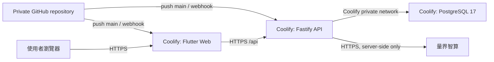

# FutureMint AI

> 第六屆中學生黑客松決賽原型｜Flutter Web + Fastify + PostgreSQL｜目標由私人 GitHub repository 自動部署到 Coolify

FutureMint AI 是青少年的 AI 金錢決策教練。使用者主動輸入收入、支出或訂閱，系統先整理成可修改草稿；只有確認後才保存，並以確定性程式更新預算、訂閱比較、金融微課程與 FutureSeed 教育試算。

主辦方 Azure 環境已關閉，因此目前架構已改為自己的 VPS／Coolify。前端、API 與 PostgreSQL 是三個獨立 Resource；AI 由 API 呼叫量界智算，瀏覽器不會接觸資料庫或模型金鑰。目前程式與容器設定已完成，但尚未建立 Coolify resources、DNS、正式秘密或 production deployment。

## 現在可以做什麼

- 用繁體中文輸入「今天買珍奶 75」、「打工薪水 1500」或「Netflix 390 四個人分」。
- 查看量界智算或 deterministic demo 的解析來源，修正金額／項目／分類後再確認保存。
- 用電子郵件與密碼註冊、登入、登出，並完成首次預算與目標設定。
- 每個帳號只能讀寫自己的 PostgreSQL profile、事件與課程資料；重啟 API 後資料仍保留。
- 查看本月可用預算、目標進度、近期事件、訂閱比較與個人化金融微課程。
- 以每月投入、期間及公開假設年化率預覽本金、假設成長與年度數值。
- 以訪客模式體驗；訪客資料只留在 App 記憶體，重新整理後清除。

決賽只使用合成資料與測試帳號，不串接支付、銀行、電子發票、證券交易或真實未成年人金融服務。

## 三個 Coolify Resources

| Resource | 專案路徑／映像 | 對外 port | 健康檢查 | 秘密 |
|---|---|---:|---|---|
| `futuremint-web` Application | `apps/client/Dockerfile` | 3000 | `/` | 無；只有 build-time `API_BASE_URL` |
| `futuremint-api` Application | `services/api/Dockerfile` | 3000 | `/api/health` | `DATABASE_URL`、`LIANGJIE_API_KEY` |
| `futuremint-postgres` Database | Coolify PostgreSQL 17 Resource | 不公開 | Coolify 管理 | 使用 Coolify 產生的 credentials |



Coolify 從 GitHub 讀取程式碼，不會讀取開發者電腦。PostgreSQL 不開公網 port；前端的 `API_BASE_URL` 是公開網址，不是秘密。詳細欄位與部署順序見 [Coolify 部署說明](docs/deployment.md)。

## 專案結構

```text
FutureMint_AI/
├── apps/client/                  # Flutter Android／iOS／Web；Nginx Web image
├── services/api/                 # Fastify TypeScript API；PostgreSQL migrations
│   ├── migrations/              # 啟動前自動執行的版本化 SQL
│   ├── src/contracts/            # API 契約與 Zod 驗證
│   ├── src/domain/               # 確定性財務計算
│   ├── src/application/          # Use cases 與 ports
│   ├── src/adapters/             # 量界／Demo／PostgreSQL／Memory adapters
│   └── src/http/                 # Fastify routes、CORS、rate limit、錯誤處理
├── design-system/futuremint-ai/  # 設計規範，非部署元件
├── docs/                         # 產品、架構、競賽、測試與部署文件
└── AGENTS.md                     # 開發、資料與 Git 安全規則
```

## 本機快速啟動

前置需求：Node.js 22.x、npm、Flutter 3.41.x／Dart 3.11.x；要測持久化需 PostgreSQL 17。

### 無外部服務的 Demo API

```bash
cd services/api
npm ci
AI_PROVIDER=demo \
DATA_PROVIDER=memory \
ALLOWED_ORIGINS=http://localhost:4173 \
npm run dev
```

API 預設監聽 `http://localhost:3000`，健康檢查是 `http://localhost:3000/api/health`。

### PostgreSQL 與量界模式

將 `services/api/.env.example` 複製為已忽略的 `.env`，填入本機 PostgreSQL 連線與量界智算金鑰後：

```bash
cd services/api
npm run migrate
npm run dev
```

`AI_PROVIDER=liangjie` 才需要量界設定；`AI_PROVIDER=demo` 可在沒有模型金鑰時驗證完整帳號與資料流程。真實 `.env` 不得提交。

### Flutter Web

```bash
cd apps/client
flutter pub get
flutter run -d chrome \
  --web-port=4173 \
  --dart-define=API_BASE_URL=http://localhost:3000/api/
```

API 的 `ALLOWED_ORIGINS` 必須包含完整前端 origin，例如 `http://localhost:4173`；多個 origin 用逗號分隔，不使用任意 `*`。

## Docker 建置

```bash
docker build -t futuremint-api services/api

docker build \
  --build-arg API_BASE_URL=https://api.example.com/api/ \
  -t futuremint-web apps/client
```

API image 在 `DATA_PROVIDER=postgres` 時會於每次啟動先執行 idempotent migration，再啟動 Fastify。Coolify 的正式設定、private GitHub App、domains、環境變數、備份與 rollback 步驟見 [部署說明](docs/deployment.md)。

## 品質指令

API：

```bash
cd services/api
npm ci
npm test
npm run typecheck
npm run build
npm run evaluate:captures
npm audit --omit=dev
```

Flutter：

```bash
cd apps/client
flutter pub get
dart format --output=none --set-exit-if-changed lib test integration_test
flutter analyze
flutter test
flutter build web --release \
  --dart-define=API_BASE_URL=https://api.example.com/api/
```

已實際執行的結果與未驗證項目記錄在 [測試與證據](docs/testing-and-evidence.md)。

## 環境變數與秘密

前端只有公開的 build argument：

- `API_BASE_URL`：必須是以 `/api/` 結尾的 API HTTPS base URL。改值後必須重新 build 前端。

API 變數名稱索引在 `services/api/.env.example`。Coolify production 至少需要：

- `NODE_ENV=production`
- `HOST=0.0.0.0`
- `PORT=3000`
- `AI_PROVIDER=liangjie`
- `DATA_PROVIDER=postgres`
- `DATABASE_URL=<Coolify internal PostgreSQL URL>`
- `DATABASE_SSL=false`
- `LIANGJIE_BASE_URL=https://liangjiewis.com/v1`
- `LIANGJIE_MODEL=<已由帳號確認可用的模型>`
- `LIANGJIE_API_KEY=<secret>`
- `ALLOWED_ORIGINS=https://<frontend-domain>`

不得提交真實 API key、password、connection string、production `.env`、個資、合約或商業文件。量界與資料庫秘密只放 API Resource 的 runtime environment，不可放前端或 Docker build arguments。

## 部署與 Git 狀態

- 目標：private GitHub repository 的 `main` 經 Coolify GitHub App／webhook 自動部署。
- 目前 workspace 尚未設定 Git remote，也沒有執行 commit、push、Coolify resource 建立、DNS 或正式部署。
- Coolify 正式 domain、VPS 容量、PostgreSQL 備份目的地、量界帳號模型與額度仍需在平台內人工設定及驗證。
- 部署不需要 Azure VM、Azure Functions、Cosmos DB 或 Azure OpenAI。

## 文件索引

- [Coolify 部署說明](docs/deployment.md)
- [Hosting Resources](docs/hosting-resources.md)
- [系統架構](docs/architecture.md)
- [資料與儲存](docs/data-and-storage.md)
- [外部整合與 AI](docs/integrations.md)
- [安全、身份與隱私](docs/security-and-privacy.md)
- [測試與證據](docs/testing-and-evidence.md)
- [Demo 腳本](docs/demo-script.md)
- [競賽與展示準備](docs/competition.md)
- [專案範圍與驗收](docs/project-overview.md)
- [學生專案 Profile](docs/project-profile.md)
- [Flutter Client](apps/client/README.md)
- [Fastify API](services/api/README.md)
- [Design System](design-system/README.md)
- [團隊開發規則](AGENTS.md)

## 維護與交接

- 功能、資料契約、品質指令或驗證結果改變時，同步更新根 README、元件 README 與測試文件。
- AI provider、資料庫、環境變數或部署狀態改變時，同步更新整合、資料、安全與部署文件。
- 所有 commit／push 都必須先依 [AGENTS.md](AGENTS.md) 掃描 staged、unstaged、untracked 與 diff；本次遷移未執行版本控制或外部發布。
- LICENSE 尚未選定；需先確認團隊作者、學校、競賽、套件、模型、資料與素材授權。
