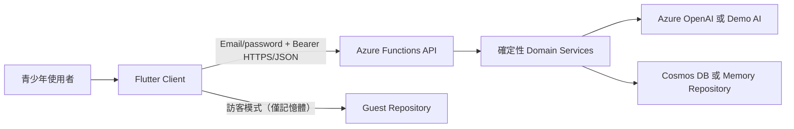

# FutureMint AI

> 第六屆中學生黑客松決賽原型｜Flutter + Microsoft Azure｜產品系統已可於本機完整展示，Azure 尚未部署

FutureMint AI 是青少年的 AI 金錢決策教練。使用者主動輸入收入、支出或訂閱，系統先整理成可修改草稿；只有確認後才保存，並以確定性程式更新預算、訂閱比較、金融微課程與 FutureSeed 教育試算。

## 現在可以做什麼

- 用繁體中文輸入「今天買珍奶 75」、「打工薪水 1500」或「Netflix 390 四個人分」。
- 查看解析來源、修正金額／項目／分類，再確認保存；解析本身不會寫入帳本。
- 查看本月可用預算、目標進度、近期事件與非責備式教練提醒。
- 比較合成訂閱方案的每月成本、節省差額與資格提醒。
- 完成依合成紀錄挑選的金融微課，留下下一個可行動選擇。
- 以每月投入、期間及公開假設年化率預覽本金、假設成長與年度數值。
- 以電子郵件與密碼建立帳號、登入及完成首次預算／目標設定；每個帳號只能讀寫自己的資料。
- 以訪客模式先體驗，但資料只留在當次 App 記憶體，離開或重新整理後即清除。
- 呼叫 Azure Functions API；斷網或服務失敗時會明示錯誤，不會自動改用或偽造資料。

決賽只使用合成資料與測試帳號，不串接支付、銀行、電子發票、證券交易或真實未成年人金融服務。

## 專案資訊

- Repository：`FutureMint_AI`
- Project slug：`futuremint-ai`
- Stage：`competition`
- Product type：`hybrid`
- Bootstrap mode：`executable`
- Executable components：`apps/client`、`services/api`
- Supporting asset：`design-system`（設計規範，沒有 runtime 或部署生命週期）
- Deployment：Microsoft Azure（已規劃，尚未部署）
- Collaboration：學生團隊／Pull Request 工作流

完整分類、限制、假設與未決事項見 [學生專案 Profile](docs/project-profile.md)。

## 系統架構與狀態

| 元件 | 路徑 | 實作 | 本機狀態 | 雲端狀態 |
|---|---|---|---|---|
| Flutter Client | `apps/client/` | Material 3、Provider、go_router、HTTP、SharedPreferences | Web build 與自動化測試通過 | Static Web Apps 尚未部署 |
| Functions API | `services/api/` | Functions v4、TypeScript、Zod、Vitest | 全部端點、domain 與 adapters 可建置／測試 | Functions 尚未部署 |
| AI providers | `services/api/src/adapters/` | Azure OpenAI structured output + deterministic demo | mock 與離線 provider 已驗證 | 未驗證即時 Azure 連線 |
| Data providers | `services/api/src/adapters/` | Cosmos DB + in-memory repository | mock／memory 已驗證 | Cosmos 資源尚未建立 |
| Design System | `design-system/` | 色彩、字體、響應式、元件與可及性規範 | 文件已建立，由人工檢查 | 非部署元件 |
| Evidence | `services/api/reports/` | 30 筆合成繁中解析評估 | 30/30 完整通過 | 不代表 Azure AI 成效 |



金額、預算、訂閱成本與 FutureSeed 都由確定性程式計算；模型輸出永遠視為待驗證資料。詳細邊界見 [系統架構](docs/architecture.md)。

## 專案結構

```text
FutureMint_AI/
├── apps/client/                  # Flutter Android／iOS／Web
├── services/api/                 # Azure Functions TypeScript API
│   ├── src/contracts/            # 共享資料契約與 Zod 驗證
│   ├── src/domain/               # 確定性財務計算
│   ├── src/application/          # Use cases 與 ports
│   ├── src/adapters/             # Azure／Demo／Cosmos／Memory adapters
│   └── src/functions/            # HTTP Functions v4 routes
├── design-system/futuremint-ai/  # 經 UI/UX skill 整理的設計規範
├── docs/                         # 產品、架構、競賽、測試與部署文件
└── AGENTS.md                     # 開發、資料與 Git 安全規則
```

## 快速啟動

### 1. 本機 Functions

前置需求為 Node.js 22.x 與 Azure Functions Core Tools 4.x：

```bash
cd services/api
npm ci
npm run build
npm start
```

本機實際 provider 設定放在已忽略的 `services/api/local.settings.json`。最簡單的無雲端組合是：

```json
{
  "IsEncrypted": false,
  "Values": {
    "FUNCTIONS_WORKER_RUNTIME": "node",
    "AI_PROVIDER": "demo",
    "DATA_PROVIDER": "memory",
    "ALLOWED_ORIGINS": "http://localhost:4173"
  }
}
```

HTTP-only demo routes 在未設定 Storage 時仍可本機執行；若要讓 Functions Host 的 storage health probe 也正常，請另啟動 Azurite 並設定 `AzureWebJobsStorage=UseDevelopmentStorage=true`。不得把真實 storage connection string 寫入 repository。

### 2. 啟動 Flutter Client

前置需求為 Flutter 3.41.x／Dart 3.11.x 與 Chrome。讓 Client 連到 Functions（URL 需指向 `/api/`）：

```bash
cd apps/client
flutter pub get
flutter run -d chrome \
  --web-port=4173 \
  --dart-define=API_BASE_URL=http://localhost:7071/api/
```

Functions 只會對 `ALLOWED_ORIGINS` 內的完整 origin 回傳 CORS headers，因此 Web 的 port 必須與設定一致；多個 origin 以逗號分隔，不使用任意 `*`。沒有網路時可使用訪客模式查看暫存功能，但不會保存或偽造 API 成功。

## 品質與證據

Functions：

```bash
cd services/api
npm ci
npm test
npm run typecheck
npm run build
npm run evaluate:captures
npm audit --omit=dev
```

Flutter：

```bash
cd apps/client
flutter pub get
dart format --output=none --set-exit-if-changed lib test integration_test
flutter analyze
flutter test
flutter build web
```

已實際驗證的最新結果與尚未驗證項目見 [測試與證據](docs/testing-and-evidence.md)。固定展示流程見 [Demo 腳本](docs/demo-script.md)。

## 公開設定與秘密

Flutter 只有一個 Dart define，且不是秘密：

- `API_BASE_URL`：Functions `/api/` base URL

Functions 的變數名稱索引在 `services/api/.env.example`。真實 key、token、connection string、production `.env`、`local.settings.json`、真實學生資料與商業／法務文件不得提交。能取得 RBAC 時，Azure OpenAI 與 Cosmos 優先使用 Managed Identity。

## 部署狀態

沒有建立、修改或部署任何 Azure 資源，也沒有可宣稱的 production URL。目標架構是 Azure Static Web Apps、Functions、Cosmos DB、Azure OpenAI／Foundry 與 Application Insights；部署前仍須確認主辦方 RBAC、quota、區域、CORS、費用與回滾。詳見 [部署說明](docs/deployment.md)。

## 文件索引

- [學生專案 Profile](docs/project-profile.md)
- [專案範圍與驗收](docs/project-overview.md)
- [產品規格與決賽策略](docs/product-spec.md)
- [系統架構](docs/architecture.md)
- [Azure 資源規劃](docs/azure-resources.md)
- [資料與儲存](docs/data-and-storage.md)
- [外部整合與 AI](docs/integrations.md)
- [安全、身份與隱私](docs/security-and-privacy.md)
- [測試與證據](docs/testing-and-evidence.md)
- [Demo 腳本](docs/demo-script.md)
- [競賽與展示準備](docs/competition.md)
- [部署說明](docs/deployment.md)
- [Flutter Client](apps/client/README.md)
- [Functions API](services/api/README.md)
- [Design System](design-system/README.md)
- [團隊開發規則](AGENTS.md)

## Git 與授權

- Repository：`FutureMint_AI`；目前 branch：`main`。
- 初始化固定 commit：`feb7938 chore(init): 初始化學生專案結構`。
- 目前沒有設定 remote；後續產品與文件變更尚未 commit、push、建立 PR 或部署。
- 進行任何版本控制提交前，必須依 [AGENTS.md](AGENTS.md) 檢查 staged、unstaged 與 untracked 內容，排除 secrets、個資、合約與商業文件。

## 維護與交接

- 功能、資料契約、品質指令或驗證結果改變時，同步更新根 README、元件 README 與 [測試與證據](docs/testing-and-evidence.md)。
- 視覺 token、響應式規則或可及性要求改變時，同步更新 [Design System](design-system/README.md) 與 Flutter `lib/design/`。
- Azure provider、資料庫、環境變數或部署狀態改變時，同步更新整合、資料、安全與部署文件。
- LICENSE 尚未選定；需先確認團隊作者、學校、競賽、套件、模型、資料與素材授權。
