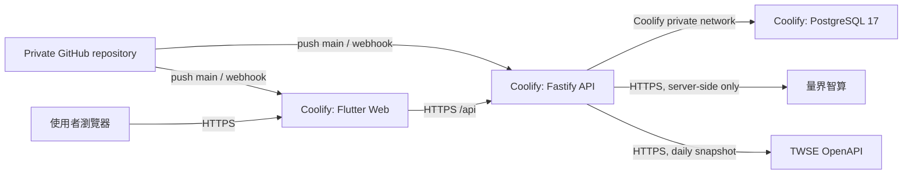

# FutureMint AI

> 第六屆中學生黑客松決賽原型｜Flutter Web + Fastify + PostgreSQL｜目標由私人 GitHub repository 自動部署到 Coolify

FutureMint AI 是青少年的 AI 金錢決策教練。使用者主動輸入收入、支出或訂閱，系統先整理成可修改草稿與「需要／想要」建議；只有確認後才保存，並以確定性程式更新收支分析、訂閱提醒、個人學習規劃、FutureSeed 複利比較與延遲行情投資練習場。

主辦方 Azure 環境已關閉，因此目前架構已改為自己的 VPS／Coolify。前端、API 與 PostgreSQL 是三個獨立 Resource；AI 由 API 呼叫量界智算，瀏覽器不會接觸資料庫或模型金鑰。目前程式與容器設定已完成，但尚未建立 Coolify resources、DNS、正式秘密或 production deployment。

## 命名對照

| 用途 | 名稱 |
|---|---|
| GitHub repository／本機根資料夾 | `FutureMint_AI` |
| Project slug／Coolify project | `futuremint-ai` |
| 本機 Docker Compose project | `futuremint_ai` |
| Coolify services | `futuremint-ai-web`、`futuremint-ai-api`、`futuremint-ai-postgres` |

主要 `compose.yaml` 明確設定 `name: futuremint_ai`；Compose services 使用 `web`、`api`、`postgres` 且不設定 `container_name`。

## 現在可以做什麼

- 用繁體中文輸入「今天買珍奶 75」、「打工薪水 1500」或「Netflix 390 四個人分」。
- 查看量界智算或 deterministic demo 的解析來源，修正金額／項目／分類／需要或想要後再確認保存。
- 用電子郵件與密碼註冊、登入、登出，並完成首次預算與目標設定。
- 每個帳號只能讀寫自己的 PostgreSQL profile、事件與課程資料；重啟 API 後資料仍保留。
- 先看六個月收支、需要／想要比例與圖形化提醒，再查看長期交易明細。
- 以 AI 摘要產生個人理財學習路線，並保留可完成的三分鐘微課。
- 在訂閱續訂前收到使用頻率檢查提醒；提醒不會直接把訂閱判定為浪費。
- 以已省金額、每月投入與期間比較「穩穩存 1.5%」、「慢慢長 5%」與「高風險 8%」三條版本化合成路徑，並用 AI 陪讀員解釋回檔、分散與複利。
- 在投資練習場查看證交所官方每日成交快照，用虛擬現金買賣五個跨產業教學標的；持倉、成本、配置、報酬與訂單紀錄由程式計算，登入後保存到 PostgreSQL。
- 擲出可重現的市場事件卡，再由 AI 陪讀員解釋波動、集中、題材、現金與費用；骰子不決定買賣，也不提供明牌。
- 選擇孩子或家長陪伴角色；目前只調整內容視角，不提供跨帳號監控或共管。
- 從設定開啟四步使用介紹與不讀取交易明細的制式客服機器人。
- 以訪客模式體驗；訪客資料只留在 App 記憶體，重新整理後清除。

決賽只使用合成資料與測試帳號，不串接支付、銀行、電子發票、證券下單或真實未成年人金融服務。FutureSeed 曲線是版本化合成情境；投資練習場使用證交所延遲日資料但只記虛擬訂單。兩者都不是即時報價、買賣建議或報酬預測。

## 三個 Coolify Resources

| Resource | 專案路徑／映像 | 對外 port | 健康檢查 | 秘密 |
|---|---|---:|---|---|
| `futuremint-ai-web` Application | `apps/client/Dockerfile` | 3000 | `/` | 無；只有 build-time `API_BASE_URL` |
| `futuremint-ai-api` Application | `services/api/Dockerfile` | 3000 | `/api/health` | `DATABASE_URL`、`LIANGJIE_API_KEY` |
| `futuremint-ai-postgres` Database | Coolify PostgreSQL 17 Resource | 不公開 | Coolify 管理 | 使用 Coolify 產生的 credentials |



Coolify 從 GitHub 讀取程式碼，不會讀取開發者電腦。PostgreSQL 不開公網 port；前端的 `API_BASE_URL` 是公開網址，不是秘密。詳細欄位與部署順序見 [Coolify 部署說明](docs/deployment.md)。

## 專案結構

```text
FutureMint_AI/
├── apps/client/                  # Flutter Android／iOS／Web；Nginx Web image
├── services/api/                 # Fastify TypeScript API；PostgreSQL migrations
│   ├── migrations/              # 啟動前自動執行的版本化 SQL
│   ├── src/contracts/            # API 契約與 Zod 驗證
│   ├── src/domain/               # 確定性財務計算
│   ├── src/application/          # Use cases 與 ports
│   ├── src/adapters/             # 量界／TWSE／Demo／PostgreSQL／Memory adapters
│   └── src/http/                 # Fastify routes、CORS、rate limit、錯誤處理
├── design-system/futuremint-ai/  # 設計規範，非部署元件
├── docs/                         # 產品、架構、競賽、測試與部署文件
└── AGENTS.md                     # 開發、資料與 Git 安全規則
```

`apps/client/` 與 `services/api/` 是本專案已建立並持續使用的 `structure_exception`；兩個目錄本身就是 framework root，`pubspec.yaml`／`package.json` 直接位於 component 根目錄。不得再包成 `app/<project-name>/`、`apps/client/flutter/` 或其他額外層級；新學生專案仍以 `app/`、`backend/` 等固定 root 為預設。

## 本機快速啟動

前置需求：Node.js 22.x、npm、Flutter 3.41.x／Dart 3.11.x；要測持久化需 PostgreSQL 17。

### Docker Compose：一個專案群組

```bash
docker compose up -d --build --wait
```

Docker Desktop 會顯示一個可展開的 `futuremint_ai` Compose 專案，內含 `web`、`api`、`postgres` 三個服務容器；這保留 Coolify 的正確部署邊界，不把資料庫與 Web 強塞進同一容器。

- Web：`http://localhost:14173/`
- API health：`http://localhost:13000/api/health`
- 停止服務：`docker compose down`
- 停止並清除本機資料：`docker compose down -v`

Compose 使用 `AI_PROVIDER=demo`、PostgreSQL named volume 與只在私有 Docker network 內生效的免密碼本機設定。它適合本機展示，不可直接當 production database 設定。

### 無外部服務的 Demo API

```bash
cd services/api
npm ci
AI_PROVIDER=demo \
DATA_PROVIDER=memory \
ALLOWED_ORIGINS=http://localhost:4173 \
npm run dev
```

API 預設監聽 `http://localhost:3000`，健康檢查是 `http://localhost:3000/api/health`。

### PostgreSQL 與量界模式

將 `services/api/.env.example` 複製為已忽略的 `.env`，填入本機 PostgreSQL 連線與量界智算金鑰後：

```bash
cd services/api
npm run migrate
npm run dev
```

`AI_PROVIDER=liangjie` 才需要量界設定；`AI_PROVIDER=demo` 可在沒有模型金鑰時驗證完整帳號與資料流程。真實 `.env` 不得提交。

### Flutter Web

```bash
cd apps/client
flutter pub get
flutter run -d chrome \
  --web-port=4173 \
  --dart-define=API_BASE_URL=http://localhost:3000/api/
```

API 的 `ALLOWED_ORIGINS` 必須包含完整前端 origin，例如 `http://localhost:4173`；多個 origin 用逗號分隔，不使用任意 `*`。

## 個別 Docker image 建置

```bash
docker build -t futuremint-ai-api services/api

docker build \
  --build-arg API_BASE_URL=https://api.example.com/api/ \
  -t futuremint-ai-web apps/client
```

API image 在 `DATA_PROVIDER=postgres` 時會於每次啟動先執行 idempotent migration，再啟動 Fastify。Coolify 的正式設定、private GitHub App、domains、環境變數、備份與 rollback 步驟見 [部署說明](docs/deployment.md)。

## 品質指令

API：

```bash
cd services/api
npm ci
npm test
npm run typecheck
npm run build
npm run evaluate:captures
npm audit --omit=dev
```

Flutter：

```bash
cd apps/client
flutter pub get
dart format --output=none --set-exit-if-changed lib test integration_test
flutter analyze
flutter test
flutter build web --release \
  --dart-define=API_BASE_URL=https://api.example.com/api/
```

已實際執行的結果與未驗證項目記錄在 [測試與證據](docs/testing-and-evidence.md)。

## 環境變數與秘密

前端只有公開的 build argument：

- `API_BASE_URL`：必須是以 `/api/` 結尾的 API HTTPS base URL。改值後必須重新 build 前端。

API 變數名稱索引在 `services/api/.env.example`。Coolify production 至少需要：

- `NODE_ENV=production`
- `HOST=0.0.0.0`
- `PORT=3000`
- `AI_PROVIDER=liangjie`
- `DATA_PROVIDER=postgres`
- `DATABASE_URL=<Coolify internal PostgreSQL URL>`
- `DATABASE_SSL=false`
- `LIANGJIE_BASE_URL=https://liangjiewis.com/v1`
- `LIANGJIE_MODEL=<已由帳號確認可用的模型>`
- `LIANGJIE_API_KEY=<secret>`
- `ALLOWED_ORIGINS=https://<frontend-domain>`

不得提交真實 API key、password、connection string、production `.env`、個資、合約或商業文件。量界與資料庫秘密只放 API Resource 的 runtime environment，不可放前端或 Docker build arguments。

## 部署與 Git 狀態

- 目標：private GitHub repository 的 `main` 經 Coolify GitHub App／webhook 自動部署。
- 目前 workspace 已設定 GitHub remote；尚未建立 Coolify resources、DNS、正式秘密或 production deployment。
- Coolify 正式 domain、VPS 容量、PostgreSQL 備份目的地、量界帳號模型與額度仍需在平台內人工設定及驗證。
- 部署不需要 Azure VM、Azure Functions、Cosmos DB 或 Azure OpenAI。

## 文件索引

- [Coolify 部署說明](docs/deployment.md)
- [Hosting Resources](docs/hosting-resources.md)
- [系統架構](docs/architecture.md)
- [資料與儲存](docs/data-and-storage.md)
- [外部整合與 AI](docs/integrations.md)
- [安全、身份與隱私](docs/security-and-privacy.md)
- [測試與證據](docs/testing-and-evidence.md)
- [Demo 腳本](docs/demo-script.md)
- [競賽與展示準備](docs/competition.md)
- [專案範圍與驗收](docs/project-overview.md)
- [學生專案 Profile](docs/project-profile.md)
- [Flutter Client](apps/client/README.md)
- [Fastify API](services/api/README.md)
- [Design System](design-system/README.md)
- [團隊開發規則](AGENTS.md)

## 授權

本專案採用 [MIT License](LICENSE)，著作權標示為 FutureMint AI Contributors。

## 維護與交接

- 功能、資料契約、品質指令或驗證結果改變時，同步更新根 README、元件 README 與測試文件。
- AI provider、資料庫、環境變數或部署狀態改變時，同步更新整合、資料、安全與部署文件。
- 所有 commit／push 都必須先依 [AGENTS.md](AGENTS.md) 掃描 staged、unstaged、untracked 與 diff；本次遷移未執行版本控制或外部發布。
- 新增套件、模型、資料或素材時仍需逐項確認來源、競賽規則與 attribution。
