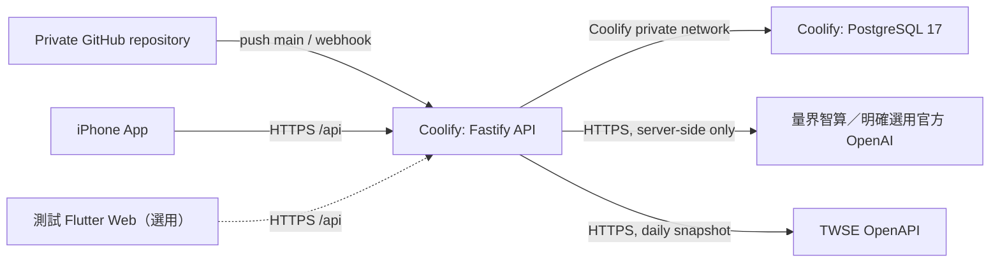

# FutureMint AI

> 由黑客松原型轉為正式產品準備｜iPhone App Store 上架準備｜Flutter iPhone + Fastify + PostgreSQL（Web 僅供測試）｜目標由私人 GitHub repository 自動部署到 Coolify

FutureMint AI 是青少年的 AI 金錢決策教練。使用者以繁體中文主動輸入收入、支出或訂閱（目前只接受文字／貼上，不提供圖片上傳或 OCR），系統先整理成可修改草稿與「需要／想要」建議；只有確認後才保存，並以確定性程式更新收支分析、訂閱提醒、個人學習規劃、FutureSeed 複利比較與延遲行情投資練習場。

主辦方 Azure 環境已關閉，因此目標架構已改為團隊 VPS／Coolify。正式 iPhone 只需 API 與 PostgreSQL 兩個獨立 Resource，Web Resource 保留為選用測試；AI 由 API 呼叫量界智算，瀏覽器不會接觸資料庫或模型金鑰。Repository 已具備 Dockerfile、migration、health check 與三 Resource 設定文件；使用者確認既有 Coolify 三 Resources 曾成功部署；目前 live health、DNS／TLS、runtime 設定與完整使用者流程尚未在本輪驗證。本次程式變更需由使用者自行重新部署並驗收。

## 命名對照

| 用途 | 名稱 |
|---|---|
| GitHub repository／本機根資料夾 | `FutureMint_AI` |
| Project slug／Coolify project | `futuremint-ai` |
| 本機 Docker Compose project | `futuremint_ai` |
| Coolify services | `futuremint-ai-web`、`futuremint-ai-api`、`futuremint-ai-postgres` |

主要 `compose.yaml` 明確設定 `name: futuremint_ai`；Compose services 使用 `web`、`api`、`postgres` 且不設定 `container_name`。

## 現在可以做什麼

- 用繁體中文輸入「今天買珍奶 75」、「打工薪水 1500」或「Netflix 390 四個人分」。
- 查看所選量界智算／官方 OpenAI 或 deterministic demo 的解析來源，修正金額／項目／分類／需要或想要後再確認保存。
- 在紀錄頁編輯或刪除自己已保存的收入、支出與訂閱；預算、分析與訂閱比較會立即重算。
- 用電子郵件與密碼註冊、登入、登出；啟用 SMTP 的正式環境先驗證 Email，再完成首次預算與目標設定，並可申請密碼重設。未啟用 SMTP 時可直接註冊／登入，信箱只作未驗證登入識別、沒有寄信重設密碼；15–17 歲仍須監護人同意才能使用正式資料功能。
- 在第三方 AI 功能啟用前分段查看當前供應商、接收方、資料類別與用途，從詳細資訊查看完整同意版本；可選擇不啟用或日後撤回，未同意時 Client 與 API 都會擋住第三方 AI 請求。
- 已登入帳號可在 App 內輸入目前密碼並二次確認，刪除帳號及其預算、紀錄、課程、虛擬投資與家庭關聯。
- 每個帳號只能讀寫自己的 PostgreSQL profile、事件與課程資料；重啟 API 後資料仍保留。
- 先看六個月收支、需要／想要比例與圖形化提醒，再查看長期交易明細。
- 由 AI 依分類摘要選擇教材主題與順序，教學內容來自受控繁體中文教材，並保留可完成的三分鐘微課。
- 在學習頁自由輸入問題，選擇「一句話重點／生活例子／一步一步」回答方式；學習規劃仍會依帳號摘要調整。
- 在訂閱續訂前收到使用頻率檢查提醒；提醒不會直接把訂閱判定為浪費。
- 以已省金額、每月投入與期間比較「穩穩存 1.5%」、「慢慢長 5%」與「高風險 8%」三條版本化合成路徑，並用 AI 陪讀員解釋回檔、分散與複利。
- FutureSeed 可套用從零開始、穩定累積或長期目標情境，也能自由輸入問題與選擇回答方式。
- 在投資練習場查看證交所官方每日成交快照，用虛擬現金買賣五個跨產業教學標的；持倉、成本、配置、報酬與訂單紀錄由程式計算，登入後保存到 PostgreSQL。
- 擲出可重現的市場事件卡，再由 AI 陪讀員解釋波動、集中、題材、現金與費用；骰子不決定買賣，也不提供明牌。
- 家長可建立家庭邀請碼，孩子加入後，家長只能查看孩子的預算、可用金額、目標進度與提醒數量摘要；不共享交易明細，孩子也不會取得家長資料。
- 從設定開啟四步使用介紹與不讀取交易明細的制式客服機器人。
- AI 尚未啟用時顯示淡紫資訊提示，仍可使用手動功能；虛擬投資金額是預估，送出後顯示伺服器實際成交價與行情日期，資料更新時明確提示。
- 以訪客模式體驗；訪客資料只留在 App 記憶體，重新整理後清除。

決賽只使用合成資料與測試帳號，不串接支付、銀行、電子發票、證券下單或真實未成年人金融服務。FutureSeed 曲線是版本化合成情境；投資練習場使用證交所延遲日資料但只記虛擬訂單。兩者都不是即時報價、買賣建議或報酬預測。

## Coolify Resources：正式 API／PostgreSQL，Web 選用

| Resource | 專案路徑／映像 | 對外 port | 健康檢查 | 秘密 |
|---|---|---:|---|---|
| `futuremint-ai-web` Application（測試，正式不用啟動） | `app/Dockerfile` | 3000 | `/` | 無；只有公開 URL／營運資料 build variables |
| `futuremint-ai-api` Application | `backend/Dockerfile` | 3000 | `/api/health` | `DATABASE_URL`、`LIANGJIE_API_KEY`、SMTP credentials |
| `futuremint-ai-postgres` Database | Coolify PostgreSQL 17 Resource | 不公開 | Coolify 管理 | 使用 Coolify 產生的 credentials |


```mermaid
flowchart LR
    G["Private GitHub repository"] -->|"push main / webhook"| A["Coolify: Fastify API"]
    U["iPhone App"] -->|"HTTPS /api"| A
    W["測試 Flutter Web（選用）"] -.->|"HTTPS /api"| A
    A -->|"Coolify private network"| P["Coolify: PostgreSQL 17"]
    A -->|"HTTPS, server-side only"| L["量界智算／明確選用官方 OpenAI"]
    A -->|"HTTPS, daily snapshot"| T["TWSE OpenAPI"]
```

Coolify 從 GitHub 讀取程式碼，不會讀取開發者電腦。PostgreSQL 不開公網 port；前端的 `API_BASE_URL` 是公開網址，不是秘密。詳細欄位與部署順序見 [Coolify 部署說明](docs/deployment.md)。

## 專案結構

```text
FutureMint_AI/
├── app/                  # Flutter Android／iOS／Web；Nginx Web image
├── backend/              # Fastify TypeScript API；PostgreSQL migrations
│   ├── migrations/              # 啟動前自動執行的版本化 SQL
│   ├── src/contracts/            # API 契約與 Zod 驗證
│   ├── src/domain/               # 確定性財務計算
│   ├── src/application/          # Use cases 與 ports
│   ├── src/adapters/             # 量界／TWSE／Demo／PostgreSQL／Memory adapters
│   └── src/http/                 # Fastify routes、CORS、rate limit、錯誤處理
├── design/futuremint-ai/  # 設計規範，非部署元件
├── docs/                         # 產品、架構、競賽、測試與部署文件
└── AGENTS.md                     # 開發、資料與 Git 安全規則
```

本專案採固定 component roots：Flutter 直接位於 `app/`，Fastify 直接位於 `backend/`，設計資產位於 `design/`。`pubspec.yaml`／`package.json` 直接位於 component 根目錄，不得再包成 project-name、framework-name 或其他額外層級。

## 本機快速啟動

前置需求：Node.js 22.x、npm、Flutter 3.41.x／Dart 3.11.x；要測持久化需 PostgreSQL 17。

### Docker Compose：一個專案群組

```bash
docker compose up -d --build --wait
```

Docker Desktop 會顯示一個可展開的 `futuremint_ai` Compose 專案，內含 `web`、`api`、`postgres` 三個服務容器；這保留 Coolify 的正確部署邊界，不把資料庫與 Web 強塞進同一容器。

- Web：`http://localhost:14173/`
- API health：`http://localhost:13000/api/health`
- 停止服務：`docker compose down`
- 停止並清除本機資料：`docker compose down -v`

Compose 預設使用 `NODE_ENV=development`、`AI_PROVIDER=demo`、PostgreSQL named volume 與只在私有 Docker network 內生效的免密碼本機設定。它適合本機展示，不可直接當 production database 設定；production 會拒絕 demo provider、memory repository、沒有 API origin 可作 CORS 預設或設定非 HTTPS origin，避免健康檢查正常但 Web 主線失效。

要用量界智算做本機整合驗證，將根目錄 `.env.example` 複製為已忽略的 `.env`，設定 `AI_PROVIDER=liangjie`、`LIANGJIE_BASE_URL`、已由帳號確認可用的 `LIANGJIE_MODEL` 與 `LIANGJIE_API_KEY`，再執行 `docker compose up -d --build --wait`。金鑰只會注入 API runtime；不可寫入前端 Dart define、Web image build argument、文件或版本控制。

### 無外部服務的 Demo API

```bash
cd backend
npm ci
AI_PROVIDER=demo \
DATA_PROVIDER=memory \
ALLOWED_ORIGINS=http://localhost:4173 \
npm run dev
```

API 預設監聽 `http://localhost:3000`，健康檢查是 `http://localhost:3000/api/health`。

### PostgreSQL 與量界模式

將 `backend/.env.example` 複製為已忽略的 `.env`，填入本機 PostgreSQL 連線與量界智算金鑰後：

```bash
cd backend
npm run migrate
npm run dev
```

`AI_PROVIDER=liangjie` 才需要量界設定；`AI_PROVIDER=demo` 可在沒有模型金鑰時驗證完整帳號與資料流程。真實 `.env` 不得提交。

### Flutter Web

```bash
cd app
flutter pub get
flutter run -d chrome \
  --web-port=4173 \
  --dart-define=API_BASE_URL=http://localhost:3000/api/
```

API 的 `ALLOWED_ORIGINS` 必須包含完整前端 origin，例如 `http://localhost:4173`；多個 origin 用逗號分隔，不使用任意 `*`。

### iOS App Store release build

`app/.env.appstore.example` 只是可提交的變數名索引。實際值應放在已忽略的 `app/.env.appstore.local`，再由受控腳本驗證 build number 與正式 HTTPS API URL：

```bash
cd app
cp .env.appstore.example .env.appstore.local
# 在本機填入真實值，不要提交此檔
./tool/build_ios_release.sh
```

腳本會拒絕 `localhost`、`example.invalid`、非 HTTPS 或未以 `/api/` 結尾的 `API_BASE_URL`、無效 build number，以及與 Xcode Runner 不一致的 Bundle ID，避免 iOS archive 誤連手機自身或建置錯誤身分。它只產生 IPA，不上傳、不送審；Apple Team、Bundle ID 歸屬與 signing 仍需在正確的開發者帳號驗證。

## 個別 Docker image 建置

```bash
docker build -t futuremint-ai-api backend

docker build \
  --build-arg BUILD_ENV=validation \
  --build-arg API_BASE_URL=http://localhost:13000/api/ \
  --build-arg PRIVACY_POLICY_URL=http://localhost:13000/privacy \
  --build-arg SUPPORT_URL=http://localhost:13000/support \
  --build-arg SUPPORT_EMAIL=local-validation@example.invalid \
  --build-arg SERVICE_OPERATOR=FutureMint-local-validation \
  -t futuremint-ai-web app
```

API image 每次啟動先做無 I/O 的完整設定 preflight，通過後在 `DATA_PROVIDER=postgres` 時執行 idempotent migration，再啟動 Fastify；runtime image 也包含 `curl`，可供 Coolify 的 HTTP health check 驗證 `/api/health`。Coolify 的正式設定、private GitHub App、domains、環境變數、備份與 rollback 步驟見 [部署說明](docs/deployment.md)。

## 品質指令

API：

```bash
cd backend
npm ci
npm test
npm run typecheck
npm run build
npm run evaluate:captures
npm audit --omit=dev
```

Flutter：

```bash
cd app
flutter pub get
dart format --output=none --set-exit-if-changed lib test integration_test
flutter analyze
flutter test
flutter build web --release \
  --dart-define=BUILD_ENV=validation \
  --dart-define=API_BASE_URL=http://localhost:3000/api/
```

根目錄 [.env.example](.env.example) 包含本機 Web／API port、公開 API URL、provider 模式與空白量界 key 的安全範例；可複製為 `.env` 調整 Compose 啟動位置。量界 API key 與 PostgreSQL connection string 仍只放 `backend/.env` 或 Coolify runtime secret。

已實際執行的結果與未驗證項目記錄在 [測試與證據](docs/testing-and-evidence.md)。

GitHub Actions workflow 位於 [.github/workflows/ci.yml](.github/workflows/ci.yml)，會在 `main` push 與 Pull Request 執行 API／Flutter 的測試、型別／靜態檢查與 build；基線 `af7a5df` 已有 GitHub CI 成功證據（122 API／121 Flutter tests、未簽章 iOS 與 images）；本輪變更尚未在遠端 CI 執行。

## 環境變數與秘密

前端 build arguments 均為公開設定：

- `API_BASE_URL`：必須是以 `/api/` 結尾的 API HTTPS base URL。改值後必須重新 build 前端。
- `BUILD_ENV=production`、`PRIVACY_POLICY_URL`、`SUPPORT_URL`、`SUPPORT_EMAIL`、`SERVICE_OPERATOR`：正式公開政策／支援及營運者，production 不接受 validation placeholder。

API 變數名稱索引在 `backend/.env.example`。以下為量界模式的連線變數；最小 production 範本見 `backend/.env.coolify.example`；SMTP 與外部 AI 各自有功能啟用條件，公開政策需確認，見 [部署變數表](docs/deployment.md)：

- `NODE_ENV=production`
- `HOST=0.0.0.0`
- `PORT=3000`
- `AI_PROVIDER=liangjie`
- `DATA_PROVIDER=postgres`
- `DATABASE_URL=<Coolify internal PostgreSQL URL>`
- `DATABASE_SSL=false`
- `LIANGJIE_BASE_URL=https://liangjiewis.com/v1`
- `LIANGJIE_MODEL=<已由帳號確認可用的模型>`
- `LIANGJIE_API_KEY=<secret>`
- `PUBLIC_BASE_URL=https://<api-domain>`（未填 `ALLOWED_ORIGINS` 時作為其預設）

不得提交真實 API key、password、connection string、production `.env`、個資、合約或商業文件。量界與資料庫秘密只放 API Resource 的 runtime environment，不可放前端或 Docker build arguments。

## 部署與 Git 狀態

- 目標：private GitHub repository 的 `main` 經 Coolify GitHub App／webhook 自動部署。
- Repository 已建立 Web／API Dockerfile、PostgreSQL migration、health check 與 Coolify 三 Resource 的設定契約；這些是可部署配置，不是已部署證據。
- 使用者確認既有 Coolify 三 Resources 曾成功部署；目前 live health、DNS／TLS、runtime 設定與完整使用者流程尚未在本輪驗證。本次程式變更需由使用者自行重新部署並驗收。
- 部署不需要 Azure VM、Azure Functions、Cosmos DB 或 Azure OpenAI。

## 文件索引

- [Coolify 部署說明](docs/deployment.md)
- [Hosting Resources](docs/hosting-resources.md)
- [系統架構](docs/architecture.md)
- [資料與儲存](docs/data-and-storage.md)
- [外部整合與 AI](docs/integrations.md)
- [安全、身份與隱私](docs/security-and-privacy.md)
- [測試與證據](docs/testing-and-evidence.md)
- [Demo 腳本](docs/demo-script.md)
- [競賽與展示準備](docs/competition.md)
- [專案範圍與驗收](docs/project-overview.md)
- [學生專案 Profile](docs/project-profile.md)
- [學生前端協作教學](docs/student-frontend-guide.md)（Flutter Web、VS Code 與 Git／GitHub）
- [Flutter Client](app/README.md)
- [Fastify API](backend/README.md)
- [Design System](design/README.md)
- [團隊開發規則](AGENTS.md)

## 授權

本專案採用 [MIT License](LICENSE)，著作權標示為 FutureMint AI Contributors。

## 維護與交接

- 功能、資料契約、品質指令或驗證結果改變時，同步更新根 README、元件 README 與測試文件。
- AI provider、資料庫、環境變數或部署狀態改變時，同步更新整合、資料、安全與部署文件。
- 所有 commit／push 都必須先依 [AGENTS.md](AGENTS.md) 掃描 staged、unstaged、untracked 與 diff；本次遷移未執行版本控制或外部發布。
- 新增套件、模型、資料或素材時仍需逐項確認來源、競賽規則與 attribution。

## 2026-10 正式產品準備

2026-10-02 依使用者測試回饋更新 iPhone 排版：首次設定及等待頁分區、記帳草稿優先、FutureSeed 控制／結果優先、訂閱欄位間距，並修復預算編輯彈窗空白與大字級提醒卡溢位。品牌及插圖保留；最新本機驗證與限制見 [測試證據](docs/testing-and-evidence.md)。

分類：新能力、缺陷修正與既有狀態釐清。首次正式服務以臺灣 15 歲以上為界線；未滿 15 歲僅能以合成資料訪客體驗，15–17 歲需監護人單次信件確認，18 歲以上需自行聲明。年齡政策版本為 `tw-service-age-15-v1`，既有帳號需補聲明。監護人同意、家庭摘要分享與第三方 AI 授權是三個獨立選擇；Email 確認不證明法定代理人身分，仍需營運查核與客服流程。

訂閱合約與實際付款分離：建立月繳／年繳訂閱不會自行新增支出，使用者可另記首次付款或採用自己的舊付款。編輯、停止及續訂日由穩定合約 ID 管理；支出統計只計實付紀錄，月承諾成本另列。紀錄支援分頁、手動輸入與自己的 JSON 匯出；統計使用完整資料。訂閱價格／比較為使用者輸入與合成方案，未接外部即時價格。

AI 預設量界智算，營運者可明確設定官方 OpenAI；不自動切換供應商。切換供應商、模型或資料條款後需重新授權，未啟用仍可手動記帳、管理訂閱、查看受控教材與教育試算。學習規劃依月預算及分類摘要安排，微課按需選題；沒有每週自動推課。

iPhone／Android 本機續訂提醒需使用者選擇啟用，於續訂前一天 09:00（台灣時間）排程，最多排入最早 60 個未來提醒。權限拒絕時提供「開啟通知設定」，回到 App 後重新讀取權限，不依賴 API 連線；首次拒絕後需再啟用提醒。Android 13+ 由明確操作請求通知權限，並使用非精準排程，送達可能受系統省電限制延後；重開機或 App 更新後恢復仍有效的排程。登出、刪除及切換帳號清除待送與已送提醒，舊權限回覆不得恢復舊帳號。其他裝置變動需同步後才更新。Web 只有 App 內提醒；未整合 APNs／FCM。原生編譯與真實裝置送達驗收分開記錄。

API runtime 設定來源為 `backend/src/config/aiConfig.ts`、`startupConfig.ts` 及 `backend/src/http/runtime.ts`；安全變數索引見 `backend/.env.example`。production 設定先檢查再 migration，錯誤只列階段及變數名稱。新增 migrations 008／009／010／011，既有 migration checksum 保留。

使用者確認既有 Coolify 三 Resources 曾成功部署；目前 live health、DNS／TLS、runtime 設定與完整使用者流程尚未在本輪驗證。本次程式變更需由使用者自行重新部署並驗收。

本輪選擇不建立定期資料庫備份；SMTP／domain、供應商資料說明、Apple Team／signed TestFlight、App Privacy／年齡問卷仍需按啟用功能完成外部驗收。檢查證據見 [測試與證據](docs/testing-and-evidence.md)。

## 最小 iPhone 部署模式

分類：已核准範圍調整。僅啟動 Coolify API／PostgreSQL，停止測試 Web 並關閉其 Auto Deploy。API 設定從 [最小 Runtime 範本](backend/.env.coolify.example)開始；全部取消 Buildtime。PUBLIC_BASE_URL、營運者、客服、資料地區、資料庫及模型憑證仍需真實值，確認公開頁內容後才設 PRIVACY_POLICY_REVIEWED=true。

- SMTP 可選；關閉時開放註冊／登入、不要求 Email 驗證，但不送新的確認／重設信。信箱保持未驗證；15–17 歲仍需有效監護人同意，訪客保留。
- 不備份為內建預設（BACKUP_RETENTION_DAYS=0），不刪既有資料卷或 journal。
- 供應商公開說明可放版本化 [設定](backend/src/config/providerPolicies.ts)，不必全部放 env；初始條款未完成，外部 AI 保持停用，手動功能與固定教材可用。原有 runtime overrides 仍支援。
- 量界資訊不完整時，可依使用者核准的[合成資料測試範本](docs/deployment.md#量界資訊不完整時的測試設定2026-10-02)如實揭露未知條件；reviewed 表示營運者確認告知，不表示供應商條款或真實連線已驗收。
- 成年帳號不需 SMTP；15–17 歲仍需監護人確認，寄信驗證／重設需要 SMTP。外部 AI 另需確認供應商政策與使用者同意。訪客資料僅在記憶體；API 能啟動不代表已具備完整上架條件。

公開隱私與支援頁由 API 提供 `/privacy`、`/support`，不依賴測試 Web Resource；繁中與英文可由頁面切換，或以 `?lang=zh-Hant`／`?lang=en` 指定，否則依瀏覽器語言。預設使用 App 的淺紫／靛色 tokens，另提供深色主題；公開內容尚未審核時維持 503。隱私版本預設為 `2026-10-02-optional-mail-v1`，既有 runtime 版本覆寫須同步；詳見部署文件。

公開頁品牌圖示使用 iPhone App icon，隨 API 的 `public/` 靜態資產一起建置，不需部署 Web 或新增環境變數。

## 2026-10-02 親子流程與上架檢查

分類：缺陷修正、既有流程釐清與新能力（公開發布配置檢查）。家長與孩子各自註冊、完成資格及自己的預算設定；家長在設定建立邀請碼，孩子確認摘要分享後加入。家長不代建孩子帳號；監護人同意、家庭分享與 AI 同意仍獨立。唯讀帳號可離開家庭或停用邀請碼，新增分享仍需服務資格；家庭查詢失敗會顯示重試。

`app/tool/build_ios_release.sh` 現在先執行公開服務檢查，核對 hosted／PostgreSQL、15+ 年齡政策、註冊與 SMTP 功能、AI 公開政策及雙語隱私／支援頁。未通過時停止正式 IPA 建置；`MAIL_PROVIDER=disabled` 仍可啟動最小 API，但不能當作完整 15+ 上架配置。檢查不登入、不寄信、不呼叫 AI、不寫資料。命令及人工驗收見 [部署說明](docs/deployment.md)，實際結果見 [測試與證據](docs/testing-and-evidence.md)。
