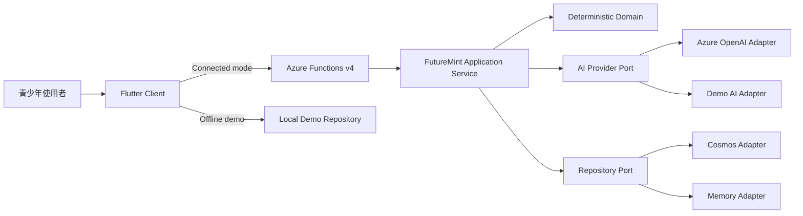

# 系統架構

## 執行模式

FutureMint AI 使用同一領域契約、兩組 provider：

1. `connected`：Flutter 經 HTTPS／JSON 呼叫 Azure Functions；Functions 依設定使用 Azure OpenAI／Demo AI 與 Cosmos／Memory。
2. `offline-demo`：Flutter 由使用者明確選擇內建 deterministic parser 與 SharedPreferences 合成資料。

Connected 失敗不會偷偷回傳離線結果。Offline 畫面與每份解析草稿都顯示來源。

## Flutter Client

- `core/`：不可變 models 與 repository contract。
- `data/`：12 秒 timeout 的 API repository，以及合成 persistence／parser。
- `state/`：AppController 管理載入、既有資料保留、capture、lesson、FutureSeed、模式與主題。
- `features/`：dashboard、capture、records、subscriptions、learning、future-seed、settings。
- `app/`：go_router deep links 與響應式 shell。
- `design/`：亮／暗 semantic tokens、48dp controls 與 Material 3 theme。

主要 routes：`/`、`/records`、`/capture`、`/learning`、`/future-seed`；`/subscriptions` 由首頁機會卡進入。手機使用五個 NavigationBar destinations，720px 起改用 NavigationRail，1100px 起首頁採雙欄。

## Functions API

- `contracts/`：MoneyEvent、Profile、Draft、Lesson、Subscription、FutureSeed 與 Zod input schemas。
- `domain/`：預算、訂閱方案與普通年金 FutureSeed 純函式。
- `application/`：parse／confirm／list／dashboard／compare／lesson／preview／reset use cases。
- `adapters/`：Azure OpenAI、Cosmos DB、deterministic demo、in-memory repositories。
- `http/`：runtime provider selection、CORS 與安全 response mapping。
- `functions/`：Functions v4 routes。

Runtime 要求明確提供 `AI_PROVIDER=azure|demo`、`DATA_PROVIDER=cosmos|memory` 與 `DEMO_RESET_ENABLED`，不合法時啟動失敗。

## Quick Capture 資料流

1. Client 送出短文字、`zh-TW` locale 與參考時間；原文不先保存。
2. Functions 驗證長度、格式與 allowed fields。
3. AI provider 回傳最多五筆候選 draft；Azure provider 使用 structured JSON output，Demo provider 使用可重現規則。
4. Functions 再以 schema／範圍驗證，標示 `azure-ai` 或 `deterministic-demo`。
5. Client 顯示可修改草稿；解析不更新 dashboard。
6. 使用者按確認後，Client 帶 idempotency key 送出 `confirmed: true` event。
7. Repository 依 `userId` 與 idempotency boundary 保存，dashboard 再由已確認事件重算。

## AI 與確定性程式邊界

| AI 可協助 | 程式必須負責 |
|---|---|
| 口語事件解析、受控分類 | 整數 TWD 金額、預算與分帳 |
| 以最小摘要生成可理解微課 | FutureSeed 公式與年度點 |
| 解釋既有方案的取捨 | 方案價格、資格條件、排序 |
| 調整非責備式表達 | schema、權限、idempotency、資料寫入 |

AI 回覆是不可信任輸入，不能直接決定保存、付款、投資或權限。

## 失敗與降級

| 情境 | Server | Client |
|---|---|---|
| validation | 統一 400／422 `ApiProblem` | 保留輸入並顯示可修正訊息 |
| AI timeout／429 | 8 秒單次、12 秒總預算、最多一次重試 | 顯示重試；不自動假成功 |
| AI schema invalid | 一次受控驗證後安全失敗 | 可保留輸入或改手動草稿 |
| Cosmos unavailable | 不回保存成功 | 保留未送出草稿與 idempotency key |
| 重送確認 | 回原事件 | 不建立重複項目 |
| 完全離線 | Connected 保持失敗 | 使用者可明確切換 Offline demo |

目前 Azure adapters 已實作並以 mock 測試；真實 Azure 資源尚未建立或連線驗證。
