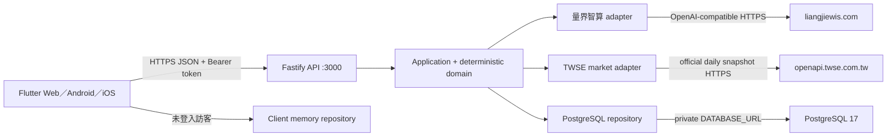

# 系統架構

## 目前架構

FutureMint AI 採三個 Coolify Resource，前端與 API 分離部署，PostgreSQL 僅存在於 Coolify private network。主辦方 Azure 環境關閉後，runtime 不再依賴 Azure Functions、Cosmos DB、Azure OpenAI 或 Static Web Apps。

`app/` 與 `backend/` 分別是 Flutter 與 Fastify 的固定 component root；manifest 直接位於 component 根目錄。`design/` 保存設計資產但不是 executable component。此架構不增加 project-name、framework-name 或其他分類包層。

### Coolify Resources

| Resource | 責任 | 網路 |
|---|---|---|
| Flutter Web Application | 編譯 release bundle，Nginx 提供 SPA 與 deep-link fallback | 公開 HTTPS |
| Fastify API Application | Authentication、契約驗證、AI 協調、確定性計算、資料 ownership | 公開 HTTPS；可連 private database |
| PostgreSQL 17 Database | Accounts、sessions、profiles、events、lessons、migration history | 不公開；只允許 Coolify internal network |

量界智算不是第四個 Coolify Resource，而是 API 使用的外部 AI provider。前端只知道 API URL。

## Component boundaries

### Flutter Client

- `lib/core/`：models、API client、session 與 repository 介面。
- `lib/features/`：Authentication、Home、Capture、Records Analysis、Notifications、Subscriptions、Learning、FutureSeed、Settings Support。
- `lib/design/`：Design System tokens 與 components。
- 瀏覽器 bundle 只含公開的 `API_BASE_URL`，不含 AI／database secret。
- 登入模式呼叫 API；訪客模式只用當次記憶體，沒有背景同步或偽造 API 成功。

### Fastify API

- `contracts/`：Zod input／output schema、錯誤與資料模型。
- `auth/`：email/password prototype、session 發行／驗證／撤銷。
- `application/`：use cases 與 repository/provider ports。
- `domain/`：預算、訂閱、六個月收支分析、提醒、FutureSeed 三情境，以及虛擬持倉／配置／事件牌組的確定性計算。
- `adapters/`：量界 AI、TWSE 每日成交資料、deterministic demo、PostgreSQL、in-memory。
- `http/`：routes、CORS、rate limit、安全 headers、錯誤 envelope。
- `migrations/`：版本化 PostgreSQL schema。

Runtime 要求明確設定 `AI_PROVIDER=demo|liangjie` 與 `DATA_PROVIDER=memory|postgres`。不合法或缺少必要秘密時啟動失敗，不會靜默切換 provider。Production 固定使用 `liangjie + postgres`；`demo + memory` 僅供離線展示與自動化測試。

## 主要資料流程

### Register／login

1. Client 送出 email/password。
2. API 以 Zod 驗證，password 用 scrypt 與隨機 salt hash。
3. PostgreSQL 保存 account；session 只保存 token hash，明文 token 只回傳一次給 Client。
4. 後續 API 從 Bearer session 推導 account，不接受前端指定 user ID。
5. Logout 將 session 設為 revoked；session 七天到期。

### Quick Capture

1. Client 送出原始文字、locale 與 reference time。
2. API 驗證 session、長度、格式與 allowed fields。
3. Provider 最多回傳五筆草稿與可修改的需要／想要建議：量界回覆先抽取 JSON，再經 Zod 與語意規則驗證；Demo provider 使用可重現規則。
4. 回覆來源標示 `liangjie-ai` 或 `deterministic-demo`。
5. 解析不寫資料庫；使用者修正並確認後才 POST MoneyEvent。
6. PostgreSQL 以 `(user_id, idempotency_key)` unique constraint 避免重複寫入。

### Dashboard／Insights／Lessons／FutureSeed

- Dashboard、收支分析、通知與訂閱比較只使用登入帳號自己的事件。
- 微課與學習規劃可由 provider 產生，但 options、modules、來源與限制仍需 schema／語意檢查。
- 三條 FutureSeed 曲線使用版本化合成年度報酬序列；金額、日期、預算、分帳、訂閱差額、複利與最大回落都由 TypeScript deterministic domain 計算，不信任模型算術。
- AI 陪讀員只解釋曲線現象，不選標的、不下單，也不改寫試算數值。

### 投資練習場

1. Client 從 API 取得五個內建教學標的的 TWSE 每日成交快照；API 驗證上游 schema 並快取 15 分鐘。
2. 登入使用者送出標的、買賣方向、數量與 idempotency key。API 從 session 推導帳號，不接受前端指定 user ID 或價格。
3. Domain 依伺服器行情檢查現金／持有量，再保存虛擬訂單；持倉、平均成本、配置與報酬每次由訂單重建。
4. 市場事件骰子由版本化牌組與帳號／日期／次數產生可重現結果，只用於學習提問。
5. 不建立券商連線，不模擬真實撮合、手續費、稅、配息或公司行動；畫面始終標示延遲與教育用途。

## HTTP 與信任邊界

- API base path：`/api`；body 上限 32 KiB。
- CORS 只允許 `ALLOWED_ORIGINS` 的完整 origin，不允許 `*`；production 缺少、帶 path／尾端 `/` 或非 HTTPS origin 時在 listen 前失敗，而不是 health 200 後才讓 Web 預檢失敗。
- 全域 rate limit 為單 instance 每分鐘 120 requests；auth routes 每分鐘 10 requests；AI routes 每分鐘 20 requests。
- API behind Coolify proxy 時只信任一跳 proxy，production client IP／HTTPS 由 Coolify reverse proxy 提供；VPS firewall 不得讓外部繞過 proxy 直接到 container port。
- 所有動態回應設 `Cache-Control: no-store`，並送出 nosniff、frame deny、referrer 與 CSP headers。
- AI output、database errors 與使用者輸入都不直接回傳 stack、SQL、prompt、key 或 SDK response。

## 失敗與降級

| 失敗 | 使用者行為 | 系統行為 |
|---|---|---|
| 量界 timeout／429／invalid JSON | 顯示可重試安全錯誤 | 不保存、不自動切 Demo、不洩漏 provider body |
| PostgreSQL unavailable | 顯示服務暫時無法使用 | health 回 503，不宣稱保存成功 |
| 重複 submit | 回同一事件 | PostgreSQL unique idempotency key 保護 |
| Session 過期／撤銷 | 回登入頁 | API 回 401 |
| Web deep link refresh | 畫面正常載入 | Nginx fallback 到 `index.html` |
| 正式網路中斷 | 可明確切訪客模式 | 訪客資料只在記憶體，不同步到帳號 |
| TWSE unavailable／schema mismatch | 顯示降級資料與日期 | 回明確標示的教育快照，不冒充即時行情 |

## 部署狀態

Dockerfiles、Nginx、migration、health check 與本機容器流程已實作。尚未建立 Coolify resources、private GitHub integration、production domains、TLS、正式 PostgreSQL backup 或量界真實連線；不得描述成已上線。詳見 [部署說明](deployment.md)與[測試證據](testing-and-evidence.md)。
