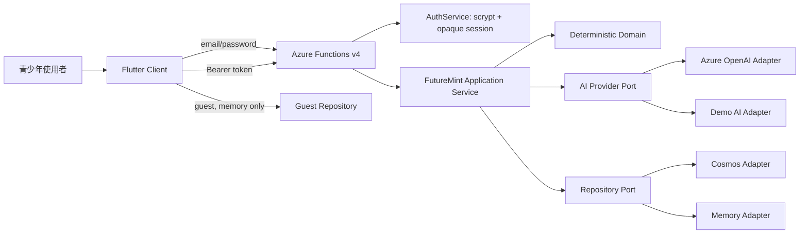

# 系統架構

## 執行模式

FutureMint AI 有兩條清楚分離的使用路徑：

1. **登入帳號**：Flutter 以 email/password 向 Functions 註冊或登入，之後以 Bearer token 呼叫 API。Functions 依設定使用 Azure OpenAI／Demo AI 與 Cosmos／Memory。
2. **訪客模式**：Flutter 使用僅記憶體的合成 repository；資料在離開、重新整理或切換帳號後清除，不會送往後端或寫入 SharedPreferences。

登入 API 失敗或沒有網路時不會自動產生保存結果，也不會切到訪客資料。畫面只顯示可重試錯誤，使用者可自行選擇訪客模式。

## Flutter Client

- `auth/`：API auth gateway、public account model、只保存 token 的 session store。
- `data/`：12 秒 timeout 的 authenticated API repository，以及訪客記憶體 repository。
- `state/`：`SessionController` 管理登入、首次設定、訪客與登出；`AppController` 管理已載入使用者資料、capture、lesson、FutureSeed 與主題。
- `features/`：auth、onboarding、dashboard、capture、records、subscriptions、learning、future-seed、settings。
- `app/`：go_router deep links 與響應式 shell。
- `design/`：亮／暗 semantic tokens、48dp controls 與 Material 3 theme。

主要內容 routes 為 `/`、`/records`、`/capture`、`/learning`、`/future-seed`；`/subscriptions` 由首頁機會卡進入。手機使用五個 NavigationBar destinations，720px 起改用 NavigationRail，1100px 起首頁採雙欄。

## Functions API

- `auth/`：email/password 驗證、opaque session、帳號公開資料轉換。
- `contracts/`：Account、Session、MoneyEvent、Profile、Draft、Lesson、Subscription、FutureSeed 與 Zod schemas。
- `domain/`：預算、訂閱方案與普通年金 FutureSeed 純函式。
- `application/`：parse／confirm／list／dashboard／compare／lesson／preview use cases。
- `adapters/`：Azure OpenAI、Cosmos DB、deterministic demo、in-memory repositories。
- `http/`：runtime provider selection、Bearer authentication、CORS 與安全 response mapping。
- `functions/`：Functions v4 routes；除 health、register、login 外均需 authentication。

Runtime 要求明確提供 `AI_PROVIDER=azure|demo` 與 `DATA_PROVIDER=cosmos|memory`，不合法時啟動失敗。

## 帳號與 ownership 資料流

1. Client 送出 email/password；後端驗證密碼規則、使用 `scrypt` 和隨機 salt 保存帳號。
2. 後端建立 32-byte opaque token，僅保存 SHA-256 hash、到期時間與撤銷狀態。
3. Client 將 token 放入 `Authorization: Bearer`。所有保護端點先驗證 session，再從帳號 ID 執行讀寫。
4. 新帳號先填預算／目標；成功保存 profile 後，後端標記 `profileComplete=true`。
5. API 無法連線或 token 過期時，Client 顯示錯誤並回登入；不改用固定資料或假裝已保存。

## Quick Capture 資料流

1. Client 送出短文字、`zh-TW` locale 與參考時間；原文不先保存。
2. Functions 驗證 Bearer session、長度、格式與 allowed fields。
3. AI provider 回傳最多五筆候選 draft；Azure provider 使用 structured JSON output，Demo provider 使用可重現規則。
4. Functions 再以 schema／範圍驗證，標示 `azure-ai` 或 `deterministic-demo`。
5. Client 顯示可修改草稿；解析不更新 dashboard。
6. 使用者按確認後，Client 帶 idempotency key 送出 `confirmed: true` event。
7. Repository 依已驗證帳號 partition 與 idempotency boundary 保存，dashboard 再由已確認事件重算。

## AI 與確定性程式邊界

| AI 可協助 | 程式必須負責 |
|---|---|
| 口語事件解析、受控分類 | 整數 TWD 金額、預算與分帳 |
| 以最小摘要生成可理解微課 | FutureSeed 公式與年度點 |
| 解釋既有方案的取捨 | 方案價格、資格條件、排序 |
| 調整非責備式表達 | schema、authentication、ownership、idempotency、資料寫入 |

AI 回覆是不可信任輸入，不能直接決定保存、付款、投資或權限。

## 失敗與降級

| 情境 | Server | Client |
|---|---|---|
| 無／無效／過期 token | 401 `unauthorized` | 清除本機 token 並回登入 |
| validation | 統一 400／422 `ApiProblem` | 保留輸入並顯示可修正訊息 |
| AI timeout／429 | 8 秒單次、12 秒總預算、最多一次重試 | 顯示重試；不自動假成功 |
| AI schema invalid | 一次受控驗證後安全失敗 | 可保留輸入或改手動草稿 |
| Cosmos unavailable | 不回保存成功 | 保留未送出草稿與 idempotency key |
| 重送確認 | 回原事件 | 不建立重複項目 |
| 完全離線 | 不呼叫 API | 可選訪客模式，但資料不保存 |

目前 Azure adapters 已實作並以 mock 測試；真實 Azure 資源尚未建立或連線驗證。
