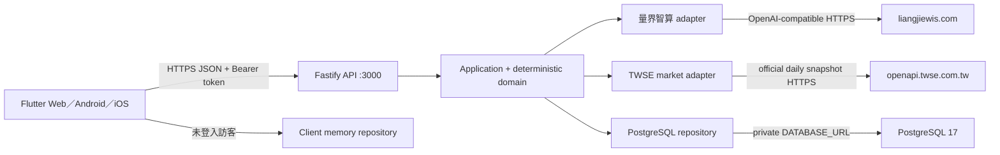

# 系統架構

## 目前架構

FutureMint AI 正式 iPhone 採 API／PostgreSQL 兩個 Coolify Resource；Flutter Web 只供選用測試，App 與 API 分開發布，PostgreSQL 僅存在於 Coolify private network。主辦方 Azure 環境關閉後，runtime 不再依賴 Azure Functions、Cosmos DB、Azure OpenAI 或 Static Web Apps。

`app/` 與 `backend/` 分別是 Flutter 與 Fastify 的固定 component root；manifest 直接位於 component 根目錄。`design/` 保存設計資產但不是 executable component。此架構不增加 project-name、framework-name 或其他分類包層。

```mermaid
flowchart LR
    U["Flutter Web／Android／iOS"] -->|"HTTPS JSON + Bearer token"| A["Fastify API :3000"]
    A --> D["Application + deterministic domain"]
    D --> Q["量界智算 adapter"]
    D --> T["TWSE market adapter"]
    D --> M["PostgreSQL repository"]
    Q -->|"OpenAI-compatible HTTPS"| L["liangjiewis.com"]
    T -->|"official daily snapshot HTTPS"| X["openapi.twse.com.tw"]
    M -->|"private DATABASE_URL"| P["PostgreSQL 17"]
    U -->|"未登入訪客"| G["Client memory repository"]
```

### Coolify Resources

| Resource | 責任 | 網路 |
|---|---|---|
| Flutter Web Application（選用測試） | 編譯 release bundle，Nginx 提供 SPA 與 deep-link fallback | 公開 HTTPS |
| Fastify API Application | Authentication、契約驗證、AI 協調、確定性計算、資料 ownership | 公開 HTTPS；可連 private database |
| PostgreSQL 17 Database | Accounts、sessions、AI consents、profiles、events、lessons、migration history | 不公開；只允許 Coolify internal network |

量界智算不是第四個 Coolify Resource，而是 API 使用的外部 AI provider。前端只知道 API URL。

## Component boundaries

### Flutter Client

- `lib/core/`：models、API client、session 與 repository 介面。
- `lib/features/`：Authentication、Home、Capture、Records Analysis、Notifications、Subscriptions、Learning、FutureSeed、Settings Support。
- `lib/design/`：Design System tokens 與 components。
- 瀏覽器 bundle 只含 API URL、公開政策／支援網址及營運者等非秘密 build 設定，不含 AI／database secret。
- 登入模式呼叫 API；訪客模式只用當次記憶體，沒有背景同步或偽造 API 成功。

### 原生本機提醒

Flutter 透過 `futuremint/subscription-reminders` 呼叫 iOS UserNotifications 與 Android NotificationManager／AlarmManager；`bind` 立即失效舊帳號與未完成的權限回覆，其他操作等待綁定清理。`status` 只讀權限，`openSettings` 使用系統 App／通知設定入口；回到前景可離線更新權限並用已載入的訂閱重排。Android receivers 不對外開放，開機／套件更新恢復使用本機 owner、綁定 token 與 id／時間檢查，舊帳號通知不得送達或導頁。Android 使用非精準排程，不要求 exact-alarm 或電池豁免；無 APNs／FCM 或新遠端服務。

### Fastify API

- `contracts/`：Zod input／output schema、錯誤與資料模型。
- `auth/`：email/password prototype、session 發行／驗證／撤銷、AI 同意與帳號刪除。
- `application/`：use cases 與 repository/provider ports。
- `domain/`：預算、訂閱、六個月收支分析、提醒、FutureSeed 三情境，以及虛擬持倉／配置／事件牌組的確定性計算。
- `adapters/`：量界 AI、TWSE 每日成交資料、deterministic demo、PostgreSQL、in-memory。
- `http/`：routes、CORS、rate limit、安全 headers、錯誤 envelope。
- `migrations/`：版本化 PostgreSQL schema。

Runtime 必填 `AI_PROVIDER=demo|liangjie|openai`，正式預設選用量界，`DATA_PROVIDER=memory|postgres` 明確設定。Production 僅接受量界或官方 OpenAI 配合 PostgreSQL，缺少必要連線秘密／公開營運政策確認時啟動失敗；未完成供應商政策則只停用外部 AI；Demo／Memory 僅供展示與測試，不自動 failover。設定先經 pure preflight 驗證，再 migration、建構服務及 listen。

## 主要資料流程

### Register／login

1. Client 送出 email/password 與 `ageDeclaration`（`ageBand`、當前政策版本、`accepted:true`）；production 未滿 15 歲拒正式註冊，15–17 歲另需監護人確認。
2. API 以 Zod 驗證，password 用 scrypt 與隨機 salt hash。
3. PostgreSQL 保存 account；session 只保存 token hash，明文 token 只回傳一次給 Client。
4. 後續 API 從 Bearer session 推導 account，不接受前端指定 user ID。
5. Logout 將 session 設為 revoked；session 七天到期。
6. 刪除帳號時需再輸入目前密碼；成功後由 account FK cascade 刪除相關主資料與 session，Client 同時清除本機 token。

### Quick Capture

1. Client 送出原始文字、locale 與 reference time。
2. API 驗證 session、長度、格式與 allowed fields；所有外部 AI runtime 還必須先確認服務資格與當前供應商 policy version 已明確授權，再取得共享每日額度及 concurrency lease。
3. Provider 最多回傳五筆草稿與可修改的需要／想要建議：量界回覆先抽取 JSON，再經 Zod 與語意規則驗證；Demo provider 使用可重現規則。
4. 回覆來源標示 `liangjie-ai`、`openai-ai` 或 `deterministic-demo`。
5. 解析不寫資料庫；使用者修正並確認後才 POST MoneyEvent。已保存紀錄可由該帳號以 `PUT` 完整修改或以 `DELETE` 刪除，Client 隨後重載摘要。
6. PostgreSQL 以 `(user_id, idempotency_key)` unique constraint 避免重複寫入。

### Dashboard／Insights／Lessons／FutureSeed

- Dashboard、收支分析、通知與訂閱比較只使用登入帳號自己的事件。
- 微課與學習規劃可由 provider 產生，但 options、modules、來源與限制仍需 schema／語意檢查。
- 學習頁與 FutureSeed 會將自由提問、主題與回答方式（brief／example／steps）送到同一個受限 coach contract；使用者可見 AI 文字必須通過繁體中文／常見簡體字驗證。
- 三條 FutureSeed 曲線使用版本化合成年度報酬序列；金額、日期、預算、分帳、訂閱差額、複利與最大回落都由 TypeScript deterministic domain 計算，不信任模型算術。
- AI 陪讀員只解釋曲線現象，不選標的、不下單，也不改寫試算數值。

### 家庭關聯

- `family_groups` 與 `family_members` 由 API 管理；家長以邀請碼建立關聯，孩子以邀請碼加入。
- API 由 session 與 profile role 執行授權。家長只能讀取孩子的彙總摘要，不會讀取孩子的 events、原始輸入或訂單；孩子只能看到角色標籤。

### 投資練習場

1. Client 從 API 取得五個內建教學標的的 TWSE 每日成交快照；API 驗證上游 schema 並快取 15 分鐘。
2. 登入使用者送出標的、買賣方向、數量與 idempotency key。API 從 session 推導帳號，不接受前端指定 user ID 或價格。
3. Domain 依伺服器行情檢查現金／持有量，再保存虛擬訂單；持倉、平均成本、配置與報酬每次由訂單重建。
   Client 畫面金額是預估，行情快取可能在送單前更新；回應後在操作區顯示實際訂單的單價／資料日，與原行情不同時明示更新。失敗或只有既有訂單的回應不宣稱新成交。
4. 市場事件骰子由版本化牌組與帳號／日期／次數產生可重現結果，只用於學習提問。
5. 不建立券商連線，不模擬真實撮合、手續費、稅、配息或公司行動；畫面始終標示延遲與教育用途。

## HTTP 與信任邊界

- API base path：`/api`；body 上限 32 KiB。
- CORS 只允許完整origin，不允許 `*`；ALLOWED_ORIGINS未填時使用PUBLIC_BASE_URL的API自身origin。production缺少可用origin、帶path／尾端 `/` 或非HTTPS時，在listen前失敗。
- 全域 rate limit 為單 instance 每分鐘 120 requests；auth routes 每分鐘 10 requests；AI routes 每分鐘 20 requests。
- API 只信任 `TRUSTED_PROXY_CIDRS` 中實際連入的 proxy IP／CIDR（空值不信任 forwarded headers），production client IP／HTTPS 由設定正確的 Coolify reverse proxy 提供；VPS firewall 不得讓外部繞過 proxy 直接到 container port。
- 所有動態回應設 `Cache-Control: no-store`，並送出 nosniff、frame deny、referrer 與 CSP headers。
- AI output、database errors 與使用者輸入都不直接回傳 stack、SQL、prompt、key 或 SDK response。

## 失敗與降級

| 失敗 | 使用者行為 | 系統行為 |
|---|---|---|
| 量界 timeout／429／invalid JSON | 顯示可重試安全錯誤 | 不保存、不自動切 Demo、不洩漏 provider body |
| PostgreSQL unavailable | 顯示服務暫時無法使用 | health 回 503，不宣稱保存成功 |
| 重複 submit | 回同一事件 | PostgreSQL unique idempotency key 保護 |
| Session 過期／撤銷 | 回登入頁 | API 回 401 |
| 未同意／已撤回第三方 AI | 保留非 AI 功能，可重新開啟資料說明 | Client 不發出 AI request；API 再於 provider 前回 403 |
| Web deep link refresh | 畫面正常載入 | Nginx fallback 到 `index.html` |
| 正式網路中斷 | 可明確切訪客模式 | 訪客資料只在記憶體，不同步到帳號 |
| TWSE unavailable／schema mismatch | 顯示降級資料與日期 | 回明確標示的教育快照，不冒充即時行情 |

## 部署狀態

使用者確認既有 Coolify 三 Resources 曾成功部署；目前 live health、DNS／TLS、runtime 設定與完整使用者流程尚未在本輪驗證。本次程式變更需由使用者自行重新部署並驗收， 詳見 [部署說明](deployment.md)與[測試證據](testing-and-evidence.md)。

## 正式產品安全與帳號恢復

AuthService 管理 Email 驗證與密碼重設；SMTP adapter 只在 API 持有憑證。Public pages 同由 API 提供 `/privacy`、`/support`、`/account/verify`、`/account/reset-password` 及自有 CSS／JS，不新增 executable component。`PUBLIC_BASE_URL` 必須指向可路由這些根路徑的 API 公開 HTTPS origin。

`withUsersTransaction` 以固定順序取得帳號鎖，並將 transaction-scoped repository 傳入 service；不得用 Pool.query 混用 transaction。家庭權限與虛擬交易依此保護跨 instance 並行操作。RateLimitStore 由相同 PostgreSQL resource 提供原子計數，沒有新增 Redis resource。

量界的教育功能只選擇教材 ID／順序，正文由 `educationCatalog.ts` 提供；自由問題仍可作選題輸入，但不生成任意理財建議。實際資料類別及安全限制以 [安全與隱私](security-and-privacy.md) 為準。

## 訂閱、分頁與跨 instance 一致性

訂閱是獨立合約；付款仍屬 MoneyEvent，可透過 `subscriptionId` 關聯。POST 合約與可選首次付款／舊付款關聯共用交易，完整 payload fingerprint 保護重試；GET 訂閱分開回傳合約、月承諾成本與舊付款候選。紀錄使用 cursor 分頁，dashboard／insights 仍以全量資料計算。

虛擬訂單以資料庫鎖內的 `executionSequence` 重建執行順序，不能使用交易開始時間判斷先後；家庭摘要在鎖定前擷取的成員集合若已變動，回 409 要求重試。日期型訂閱保留 PostgreSQL DATE 的原日曆，不經 UTC 轉換；近零報酬率複利使用穩定公式。

拒絕／撤回 AI 授權或目前唯讀時，學習頁可經 `/api/education/catalog` 讀取固定受控教材；不產生外部 AI 請求。Catalog 不含個人摘要，完成標記僅在當前 Client 記憶體，不保存於帳戶；AI 個人化選題仍需當前資格及授權。

## 簡化啟動邊界

MAIL_PROVIDER 未填／disabled 時不建立 SMTP transport，可啟動 production；AuthService 開放註冊／登入、不強制 Email 驗證，停用新的寄信請求；年齡、監護人、AI 及資料權限仍由 API 驗證。公開頁及 Client 依 mailEnabled／registrationEnabled／emailVerificationRequired 顯示可用流程。寄信停用不改年齡政策，也不把既有帳號標為已驗證。

供應商 metadata 可由 providerPolicies.ts 或 runtime overrides 提供，reviewed=false 仍能建立服務；AuthService 在授權與 AI 呼叫前拒絕未確認政策，HTTP 層另保留檢查。配置缺失不會觸發自動 Demo／供應商切換。通用政策預設在 publicConfig.ts，公開 origin 與真實營運資料仍需填寫；備份0表示無定期備份，不更動資料庫。

公開隱私與支援頁由 API 提供 `/privacy`、`/support`，不依賴測試 Web Resource；繁中與英文可由頁面切換，或以 `?lang=zh-Hant`／`?lang=en` 指定，否則依瀏覽器語言。預設使用 App 的淺紫／靛色 tokens，另提供深色主題；公開內容尚未審核時維持 503。隱私版本預設為 `2026-10-02-optional-mail-v1`，既有 runtime 版本覆寫須同步；詳見部署文件。
