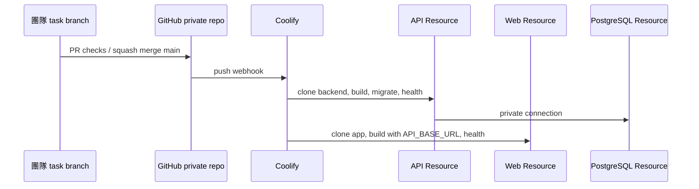

# Hosting Resources

## 為什麼是三個 Resources

主辦方 Azure 環境已關閉後，FutureMint AI 改為團隊 VPS 的 Coolify。三個 Resource 對應三種不同生命週期，不需要開 Azure VM，也不使用 Azure Functions、Cosmos DB、Static Web Apps 或 Azure OpenAI。

| Resource | 代表什麼 | 為什麼分開 | 是否公開 |
|---|---|---|---|
| `futuremint-ai-web` | Flutter Web release bundle + Nginx | 前端 build-time API URL、SPA cache 與 release 可獨立回滾 | HTTPS public |
| `futuremint-ai-api` | Node.js 22 Fastify container | 保護 AI／database secret、auth、規則、migration 與資料權限 | HTTPS public |
| `futuremint-ai-postgres` | PostgreSQL 17 + persistent volume | 資料生命週期不跟 application image 綁定，可獨立備份／還原 | Private network only |

量界智算是 API 呼叫的 external provider，不是在 Coolify 內啟動的第四個 Resource。

## Resource ownership

### Web

- Source：private GitHub `main`，Base Directory `/app`。
- Build：從 Flutter 官方 Git repository 取得並核對固定的 3.41.9 commit，執行 `flutter build web --release`。
- Runtime：Nginx 1.28 Alpine，port 3000。
- Public config：build-only `API_BASE_URL`。
- 沒有 secret、資料庫 driver 或模型 SDK。

### API

- Source：同一 private GitHub `main`，Base Directory `/backend`。
- Build／runtime：Node.js 22 Docker multi-stage image，port 3000。
- Health：`/api/health` 驗證 API 與 PostgreSQL readiness。
- Runtime secrets：`DATABASE_URL`、`LIANGJIE_API_KEY`。
- 啟動時先套用未執行的 migration，再接受流量。

### PostgreSQL

- 由 Coolify Database Resource 建立，不從 repository build。
- 使用 internal URL 給 API；不設定 public port。
- Persistent volume、scheduled full backups 與 restore rehearsal 是 production 必要條件。
- Application rollback 不會自動 rollback schema 或資料，因此每次 migration 都必須保持向前相容；破壞性 migration 需另有已演練的 backup／restore 與切換策略。

## GitHub 與部署關係

Coolify 讀的是 GitHub commit snapshot，不是團隊電腦目錄。沒有 push 的本機修改不會出現在 Coolify。Private repository 建議使用只授權單一 repository 的 GitHub App；Auto Deploy 綁定 `main`。

## 容量與可靠度起點

Competition prototype 建議先單一 API instance，因目前 rate limit 是 instance memory。實際 CPU／RAM／disk 仍需看 VPS 與 Flutter build 峰值；Flutter builder image 很大，需預留充足 Docker cache 與磁碟空間。

最低操作保障：

- Coolify server、applications 與 database 都有健康狀態與磁碟告警。
- Database full backup 存到 server 之外的 S3-compatible storage。
- 上台前保存最近一個 healthy Web／API image 與合成 demo account 流程。
- 網路或量界中斷時只切換明確訪客／deterministic demo 流程，不偽裝成正式 AI／database 成功。

逐欄設定見 [部署說明](deployment.md)，資料與秘密邊界見 [資料與儲存](data-and-storage.md)及[安全與隱私](security-and-privacy.md)。
