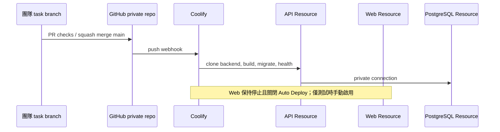

# Hosting Resources

## 正式兩個 Resources，Web 為選用測試

主辦方 Azure 環境已關閉後，FutureMint AI 改為團隊 VPS 的 Coolify。API／PostgreSQL 與選用 Web 各自維持獨立生命週期，正式 iPhone 不需啟動 Web，不需要開 Azure VM，也不使用 Azure Functions、Cosmos DB、Static Web Apps 或 Azure OpenAI。

| Resource | 代表什麼 | 為什麼分開 | 是否公開 |
|---|---|---|---|
| `futuremint-ai-web`（選用測試） | Flutter Web release bundle + Nginx | 前端 build-time API URL、SPA cache 與 release 可獨立回滾 | HTTPS public |
| `futuremint-ai-api` | Node.js 22 Fastify container | 保護 AI／database secret、auth、規則、migration 與資料權限 | HTTPS public |
| `futuremint-ai-postgres` | PostgreSQL 17 + persistent volume | 資料生命週期不跟 application image 綁定，可獨立備份／還原 | Private network only |

量界智算是 API 呼叫的 external provider，不是在 Coolify 內啟動的第四個 Resource。

## Resource ownership

### Web

- Source：private GitHub `main`，Base Directory `/app`。
- Build：從 Flutter 官方 Git repository 取得並核對固定的 3.41.9 commit，執行 `flutter build web --release`。
- Runtime：Nginx 1.28 Alpine，port 3000。
- Public config：build-only `BUILD_ENV`、`API_BASE_URL`、`PRIVACY_POLICY_URL`、`SUPPORT_URL`、`SUPPORT_EMAIL`、`SERVICE_OPERATOR`。
- 沒有 secret、資料庫 driver 或模型 SDK。

### API

- Source：同一 private GitHub `main`，Base Directory `/backend`。
- Build／runtime：Node.js 22 Docker multi-stage image，port 3000。
- Health：`/api/health` 驗證 API 與 PostgreSQL readiness。
- Runtime secrets：`DATABASE_URL`、所選 provider 的 `LIANGJIE_API_KEY` 或 `OPENAI_API_KEY`、SMTP credentials。
- 啟動時先執行 pure preflight，再套用未執行的 migration，再接受流量。

### PostgreSQL

- 由 Coolify Database Resource 建立，不從 repository build。
- 使用 internal URL 給 API；不設定 public port。
- Persistent volume 必須保留。本輪使用者選擇不建立定期備份，BACKUP_RETENTION_DAYS=0；若日後啟用備份，另設定排程／保留期限並驗收還原。
- Application rollback 不會自動 rollback schema 或資料，因此每次 migration 都必須保持向前相容；破壞性 migration 需另有已演練的 backup／restore 與切換策略。

## GitHub 與部署關係

```mermaid
sequenceDiagram
    participant Dev as 團隊 task branch
    participant GH as GitHub private repo
    participant C as Coolify
    participant API as API Resource
    participant WEB as Web Resource
    participant DB as PostgreSQL Resource
    Dev->>GH: PR checks / squash merge main
    GH->>C: push webhook
    C->>API: clone backend, build, migrate, health
    API->>DB: private connection
    Note over C,WEB: Web 保持停止且關閉 Auto Deploy；僅測試時手動啟用
```

Coolify 讀的是 GitHub commit snapshot，不是團隊電腦目錄。沒有 push 的本機修改不會出現在 Coolify。Private repository 建議使用只授權單一 repository 的 GitHub App；Auto Deploy 綁定 `main`。

## 容量與可靠度起點

PostgreSQL runtime 的 HTTP 原子限流、AI 台北日額度／concurrency leases 與帳號交易鎖跨 API instances 共用；Memory 僅供 demo。仍建議先以已驗收容量部署，增加 replicas 需重算 connection budget 與負載。實際 CPU／RAM／disk 仍需看 VPS 與 Flutter build 峰值；Flutter builder image 很大，需預留充足 Docker cache 與磁碟空間。

最低操作保障：

- Coolify server、applications 與 database 都有健康狀態與磁碟告警。
- 本輪不建立定期 Database backup，不清除既有 volume／副本／journal；若日後啟用備份，再驗收保留／還原與刪除不復活。
- 上台前保存最近一個 healthy Web／API image 與合成 demo account 流程。
- 網路或量界中斷時只切換明確訪客／deterministic demo 流程，不偽裝成正式 AI／database 成功。

逐欄設定見 [部署說明](deployment.md)，資料與秘密邊界見 [資料與儲存](data-and-storage.md)及[安全與隱私](security-and-privacy.md)。

## 正式產品新增公開入口

正式 iPhone 僅啟動 API／PostgreSQL，Web 為可停用的測試 Resource。API Resource 額外服務根路徑 `/privacy`、`/support`、`/account/verify`、`/account/reset-password`、`/public.css`、`/account-actions.js`；`PUBLIC_BASE_URL` 指向該公開 origin。新增 SMTP outbound TLS 465／587，認證只放 API runtime secret，不新增自架郵件 resource。PostgreSQL 也保存一次性 token hash 與共享限流 counters，需包含於 migration／容量監控；完整變數見 [部署文件](deployment.md)。

## 現況與重新驗收

使用者確認既有 Coolify 三 Resources 曾成功部署；目前 live health、DNS／TLS、runtime 設定與完整使用者流程尚未在本輪驗證。本次程式變更需由使用者自行重新部署並驗收。

不新增 resource；官方 OpenAI 與量界皆為 API runtime 外部 provider，iPhone 本機提醒不需要 APNs resource。既有備份目的地、排程與通知整合尚未確認，不能把 macOS credential store／Discord 頻道視為部署完成。

MAIL_PROVIDER 未填／disabled 時不需 SMTP outbound／憑證，可註冊／登入、不要求 Email 驗證，新的驗證、密碼重設與舊式監護人寄信流程未開放；現行 15–17 歲監護人聲明在 App 內完成，不需郵件 Resource 或 SMTP。聲明不代表身分查核。測試 Web 要同時停止與關閉 Auto Deploy，否則 push main 的 webhook 仍可能重新部署該 Resource。API Auto Deploy 與 Apple 發布生命週期各自獨立。

公開隱私與支援頁由 API 提供 `/privacy`、`/support`，不依賴測試 Web Resource；繁中與英文可由頁面切換，或以 `?lang=zh-Hant`／`?lang=en` 指定，否則依瀏覽器語言。預設使用 App 的淺紫／靛色 tokens，另提供深色主題；公開內容尚未審核時維持 503。隱私版本預設為 `2026-10-03-in-app-guardian-v2`；既有 `PRIVACY_POLICY_VERSION`／`MINOR_CONSENT_DISCLOSURE` runtime 覆寫須同步更新；詳見部署文件。
