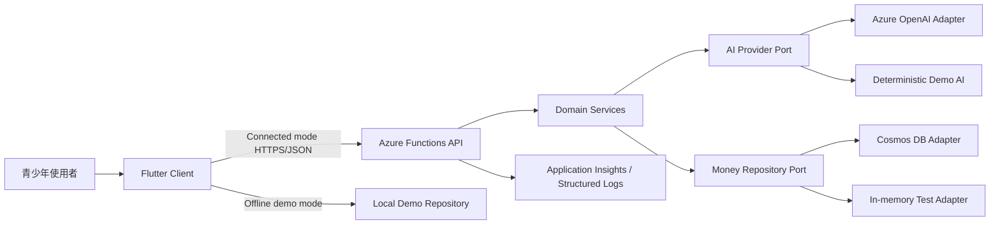

# FutureMint AI 決賽 MVP 系統設計

> 狀態：已核准整體方向，待書面規格確認
>
> 日期：2026-07-13（Asia/Taipei）
>
> 目標：在不串接真實金融服務、不保存真實未成年人財務資料的前提下，完成可於 Flutter Web／Android 展示、可接 Azure、可離線降級且可由學生團隊說明的青少年 AI 金錢決策教練。

## 1. 範圍與成功標準

本次交付是一個整合式 competition MVP，不是只有畫面的 Prototype。系統必須完整跑通：設定預算與目標、自然語言解析、草稿確認、事件保存、預算回饋、訂閱比較、個人化微課程，以及 FutureSeed 教育試算。

成功標準如下：

- Flutter Web 與 Android 共用同一套主要產品流程；iOS 維持可編譯的共用程式碼目標，但簽章不是 MVP 驗收條件。
- Azure Functions 提供有版本化資料契約、輸入驗證、統一錯誤格式與自動化測試的 HTTP API。
- Azure OpenAI 可用時執行 structured output；不可用時能明確切換到離線展示，不冒充即時 AI。
- Cosmos DB 可用時保存確認後資料；本機與測試環境可使用 repository 替身，不讓外部服務阻塞開發。
- 金額、預算、訂閱週期與複利由確定性程式計算，AI 不負責算術或寫入決策。
- 固定合成資料可在無網路狀態下完成同一條 Demo 故事。
- 所有畫面包含載入、空白、錯誤、重試、離線與無障礙狀態。

## 2. 明確不做

- 不自動讀取銀行、Apple Pay、LINE Pay、悠遊卡、電子發票、Email 或簡訊。
- 不實作付款、轉帳、開戶、證券交易、選股、信用評分或報酬保證。
- 不實作正式帳號、家長共管、學校身分、社群排行或跨世代介面。
- 不蒐集真實未成年人的姓名、學校、帳號、卡號或財務明細。
- 不建立未獲授權的 Azure 資源、不部署、不 push，也不把共享資源寫成團隊專屬資源。

## 3. 建置策略

採用「同一領域核心、雙 provider」策略：

1. **Connected mode**：Flutter 呼叫 Functions；Functions 使用 Azure OpenAI 與 Cosmos DB adapters。
2. **Local development mode**：Flutter 呼叫本機 Functions；Functions 使用 deterministic demo AI 與 in-memory repository。
3. **Offline demo mode**：Flutter 在使用者明確選擇後，使用內建合成資料與本機持久化完成展示。

系統不得在 Connected mode 失敗時偷偷偽裝成功。畫面應說明服務狀態，提供重試或「切換離線展示」動作。離線展示結果要標記為預先設計的合成情境。

## 4. 整體架構

Flutter 與 Functions 各自維持清楚邊界。Flutter 不持有 Azure secret、不直接連 Cosmos DB，也不自行判定 Azure OpenAI 回覆是否合法。Functions 將 AI 輸出視為不可信資料，經 schema、範圍與列舉值驗證後才回傳草稿。

## 5. Flutter Client 設計

### 5.1 程式結構

採 feature-first 結構，每個功能包含 domain model、repository contract、application state 與 presentation。共用區只放主題、HTTP、路由、錯誤、格式化與可被至少兩個功能使用的元件。

主要功能模組：

- `onboarding`：建立合成使用者的月預算、目標名稱、目標金額與期間。
- `dashboard`：本月可用金額、目標進度、近期事件、教練洞察與訂閱機會。
- `capture`：文字輸入、解析狀態、草稿確認／修正與保存結果。
- `records`：收入、支出、訂閱事件列表、篩選與事件詳情。
- `subscriptions`：以已記錄價格、週期與分帳人數，比較合成方案的每月成本與資格。
- `learning`：單一最相關微課、選擇題／反思題與完成狀態。
- `future-seed`：每月投入、期間、假設年化率、本金與可能成長。
- `settings`：主題、服務狀態、Demo 重設、資料與教育用途說明。

### 5.2 導覽與資訊層級

手機使用最多五個含文字標籤的主要入口：首頁、紀錄、中央記一筆、學習、未來。訂閱教練由首頁機會卡與紀錄頁的訂閱分頁進入。大型螢幕改用 NavigationRail／側欄，但保持相同層級與返回行為。

Capture 使用三段式流程：

1. 輸入自然語言或貼上已去識別通知。
2. 顯示 AI／Demo 解析中的狀態與資料來源。
3. 顯示一或多筆草稿，讓使用者修改後逐筆確認。

只有確認動作能建立正式 money event。解析完成不等於保存完成。

### 5.3 視覺與互動原則

- 品牌語言是「成長種子」與可累積的進步，風格溫暖、現代、清楚，不幼兒化也不金融機構化。
- 使用 semantic color tokens，支援亮色與深色；顏色不作為唯一狀態提示。
- 採 4／8dp spacing、最小 48dp 主要觸控區、16px 等效正文、可放大文字與安全區處理。
- 使用同一套向量圖示，不用 Emoji 作為導航或功能圖示。
- 微互動限於 150–300ms，尊重 reduced motion；載入超過 300ms 顯示 skeleton 或進度。
- 圖表同時提供數字摘要或表格；金額使用 tabular figures 與 `zh_TW` 貨幣格式。
- 每個畫面只有一個主要 CTA，錯誤訊息包含原因與恢復動作。

### 5.4 Client 狀態與設定

公開設定透過 Dart define 注入：

- `API_BASE_URL`：Functions API URL；不屬於 secret。
- `APP_MODE`：`connected` 或 `offline-demo`。

Connected mode 的 timeout、無網路與 5xx 不會自動寫入假資料。使用者可保留未送出的草稿，重試或主動切換 Offline demo mode。Offline demo 使用 browser／device local storage 保存合成資料，並提供可重建的小恩故事。

## 6. Functions API 設計

### 6.1 邊界與模組

- `http`：Azure Functions v4 route 註冊、request parsing、CORS 與 response mapping。
- `domain`：money events、預算、訂閱、lesson 與 FutureSeed 的純邏輯。
- `application`：use cases、idempotency、provider 協調與 transaction boundary。
- `adapters`：Azure OpenAI、Cosmos DB、in-memory repository 與 monitoring。
- `contracts`：request／response schema、列舉值與統一錯誤格式。

Domain code 不 import Azure SDK，因此可在沒有雲端資源時完整測試。

Functions 使用 `AI_PROVIDER=azure|demo`、`DATA_PROVIDER=cosmos|memory` 與 `DEMO_RESET_ENABLED=true|false` 明確選擇 adapters。未設定或值不合法時啟動失敗，不自動猜測 provider。Azure endpoint、deployment、database 與 monitoring 設定沿用專案既有安全變數名稱。

### 6.2 HTTP API

所有 API 使用 `/api` 前綴與 JSON。MVP 固定使用合成 `demo-user`，但每個 repository 查詢仍必須帶 `userId`，避免未來加入身分後重寫資料邊界。

- `GET /api/health`：回傳版本、mode 與已設定的 AI／data provider，不回傳 secret 或資源 ID；這是 liveness，不會 probe 雲端依賴。
- `GET /api/profile`：取得預算與目標。
- `PUT /api/profile`：驗證並更新預算與目標。
- `POST /api/captures/parse`：解析文字，回傳最多五筆未保存草稿與可能的單一澄清問題。
- `GET /api/money-events`：依日期與類型取得已確認事件。
- `POST /api/money-events`：以 idempotency key 建立確認事件。
- `GET /api/dashboard`：回傳由規則重算的預算、目標、分類與近期摘要。
- `GET /api/subscriptions`：取得已確認訂閱與合成方案資料來源說明。
- `POST /api/subscriptions/compare`：回傳方案成本、差額、資格提醒與來源類型。
- `POST /api/lessons/generate`：依已確認事件與最小摘要生成單一微課。
- `PATCH /api/lessons/{lessonId}`：保存回答與完成狀態。
- `POST /api/future-seed/preview`：回傳本金、假設成長、期末值與年度資料點。
- `POST /api/demo/reset`：只在非 production demo mode 開放，重建合成資料。

### 6.3 統一錯誤格式

錯誤回應包含：

- `code`：穩定機器碼，例如 `validation_error`、`ai_unavailable`、`conflict`。
- `message`：適合顯示或映射的繁體中文摘要。
- `requestId`：去識別追蹤 ID。
- `retryable`：是否適合重試。
- `fieldErrors`：僅驗證錯誤出現，不回顯完整敏感輸入。

HTTP status 使用 400／404／409／422／429／500／503 的既有語意。未知例外不得把 stack、prompt、環境變數或 SDK response 直接傳給 Client。

## 7. 核心資料契約

### 7.1 Money event

- `id`：server 產生的不可猜測識別碼。
- `userId`：MVP 固定為 `demo-user`。
- `type`：`income`、`expense`、`subscription`。
- `amountMinor`：正整數，TWD 最小貨幣單位；MVP 不使用浮點數保存金額。
- `currency`：MVP 固定 `TWD`。
- `category`：受控列舉，例如 food、transport、entertainment、education、shopping、income、subscription、other。
- `merchant`：可選、去識別文字。
- `occurredAt`：含時區的 ISO 8601；顯示使用 Asia/Taipei。
- `recurrence`：可選的週期與下一次日期。
- `split`：可選的人數與使用者實付金額；不保存同學姓名。
- `createdAt`、`updatedAt`：server 時間。

### 7.2 Capture draft

Draft 包含與 Money event 對應的候選欄位，另加：

- `draftId`、`confidence`、`missingFields`、`needsConfirmation`。
- `evidence`：只描述模型從文字辨識到的短標籤，不保存完整 chain-of-thought。
- `source`：`azure-ai` 或 `deterministic-demo`。

原始文字預設只在 request 生命週期存在，不寫入 Money event 或監測日誌。

### 7.3 Profile、subscription、lesson

- Profile 保存月預算、可選週預算、目標名稱、目標金額、目標日期與偏好語氣。
- Subscription 保存服務顯示名稱、使用者輸入價格、billing cycle、使用頻率與下一次日期。
- Plan option 保存合成價格、資格條件、來源類型與 `asOf`；MVP 不宣稱即時市場價格。
- Lesson 包含 title、concept（不超過 100 個中文字）、example、question、options、action、disclaimer、sourceEventIds 與 completion。

## 8. 確定性計算

### 8.1 預算

- 收入與支出分開彙總；訂閱依 billing cycle 換算為月成本時保留來源週期。
- 可用金額、分類總額、目標差距與超額狀態使用已確認事件重算。
- 邊界包含零預算、月底、跨月、退款／負值輸入拒絕、分帳與重複 idempotency key。

### 8.2 Subscription compare

排序依每月等效成本與使用者勾選的資格條件完成。AI 只能解釋已計算選項，不得新增價格、資格或服務條款。

### 8.3 FutureSeed

採每月月底投入的普通年金公式：

`FV = P × (((1 + r / 12)^n - 1) / (r / 12))`

其中 `P` 是每月投入、`r` 是使用者可見的假設年化率、`n` 是月數。`r = 0` 時使用 `FV = P × n`。結果四捨五入為 TWD 整數，並分別回傳本金 `P × n` 與假設成長 `FV - principal`。所有畫面標示教育試算、不構成投資建議且實際結果可能不同。

## 9. AI Provider 設計

### 9.1 Azure provider

- 使用支援 structured outputs 的既有 deployment，deployment 名稱只由後端設定注入。
- Parse schema 限制欄位、列舉、數值範圍與最多草稿數量。
- Prompt 只包含當次輸入、locale、參考時間與受控分類，不包含完整帳本。
- 單次模型呼叫 timeout 為 8 秒；整個 parse／lesson request 最多 12 秒。最多重試一次；429 尊重 `Retry-After` 並加入 jitter，若會超過總時間預算就直接回傳可重試錯誤。
- Schema 不合法時只允許一次受控修復；仍失敗則回傳 `ai_invalid_output`。
- 教練與微課輸入只含最小聚合摘要及必要事件，不傳其他使用者資料。

### 9.2 Deterministic demo provider

Deterministic provider 支援決賽固定合成輸入、常見繁體中文金額與日期形式、收入／支出／訂閱、分帳、否定句與缺欄位情境。它輸出相同 schema，但 `source` 必須是 `deterministic-demo`，UI 顯示離線展示標籤。

它的目的只有離線備援、自動化測試與本機開發，不作為 Azure AI 成效證據。

## 10. 儲存與一致性

Cosmos DB 使用單一 database 與按責任分開的 containers：`profiles`、`moneyEvents`、`learning`。所有文件使用 `/userId` partition key。訂閱事件先保存在 `moneyEvents`，方案目錄使用版本化的合成 fixture，不需要額外 container。

寫入流程：

1. Client 解析文字並取得 draft。
2. 使用者修改與確認。
3. Client 產生 idempotency key 並送出確認 payload。
4. Functions 重新驗證所有欄位，忽略不屬於契約的 AI 欄位。
5. Repository 以 userId 與 idempotency key 防止重複建立。
6. Dashboard 每次由已確認事件重算；不保存容易失去同步的 AI 算術結果。

## 11. 安全、隱私與監測

- Client bundle 只含公開 API URL 與模式，不含 Azure key、Cosmos key 或 connection string。
- 本機 secret 只放已忽略的 `local.settings.json`；`.env.example` 只列名稱與安全說明。
- 能取得 RBAC 時，Functions 對 OpenAI 與 Cosmos 使用 Managed Identity。
- CORS 只允許設定中的 origin；不以 `*` 搭配憑證。
- 日誌記錄 route、status、duration、provider、retry count、schema outcome 與 requestId，不記原始財務文字、prompt、Authorization 或完整 AI response。
- 金融回饋使用非責備語氣，不污名化必要支出，不提供投資標的或報酬承諾。

## 12. 失敗與降級

| 情境 | Server 行為 | Client 行為 |
|---|---|---|
| 空白、過長或無關輸入 | 422，指出可修正欄位 | 保留輸入並聚焦錯誤位置 |
| 缺少最重要欄位 | 回傳單一 clarification question | 顯示補充欄位，不先保存 |
| Azure AI timeout／429 | 有限重試後 503／429 | 顯示重試與切換離線展示 |
| AI schema 錯誤 | 一次修復後回傳安全錯誤 | 提供手動建立事件 |
| Cosmos 不可用 | 不回傳保存成功 | 保留已確認草稿與 idempotency key |
| 重送同一寫入 | 回傳原事件，不重複建立 | 顯示已保存結果 |
| 完全離線 | Connected mode 不偽裝成功 | 使用者可明確切換 Offline demo |

## 13. 測試與證據

### 13.1 Functions

- Domain unit tests：金額、預算、分帳、週期換算、FutureSeed、邊界與錯誤。
- Contract tests：每個 endpoint 的成功、validation、not found、conflict 與 provider unavailable。
- Adapter tests：mock Azure responses、429、timeout、schema invalid、Cosmos conflict 與 idempotency。
- AI evaluation fixtures：至少 30 筆合成繁體中文輸入，包含收入、單筆／多項支出、訂閱、分帳、模糊日期、缺金額、否定句與無關內容。

### 13.2 Flutter

- Model／repository tests：序列化、錯誤映射、offline persistence 與 provider switching。
- State tests：載入、成功、錯誤、重試、草稿保留與確認後更新。
- Widget tests：onboarding、dashboard、capture 三階段、訂閱比較、lesson、FutureSeed 與 responsive navigation。
- Integration test：以固定合成小恩資料走完收入／支出／訂閱／微課／FutureSeed 主線。

### 13.3 驗收證據

- `flutter analyze`、`flutter test`、`flutter build web`。
- API lint／typecheck、unit／contract tests 與 build。
- 30 筆 fixture 的欄位正確率、schema 合法率與失敗分類報告。
- 375px、tablet 與 desktop Web 人工／自動視覺檢查；亮／暗色、reduced motion 與文字放大檢查。
- Demo 正常模式、AI 失敗、Cosmos 失敗與 Offline demo 各走一次。

## 14. 實作切片

整體系統依可獨立驗收的垂直切片完成：

1. **基礎與契約**：設計 tokens、導覽、domain models、API 錯誤契約、health 與測試框架。
2. **Quick Capture 閉環**：parse、確認、idempotent save、records、dashboard 與離線草稿。
3. **Subscription Coach**：週期換算、合成方案、資格提醒與比較畫面。
4. **Learning Loop**：最小資料摘要、lesson provider、反思與完成狀態。
5. **FutureSeed**：確定性公式、年度資料、圖表與教育提示。
6. **Azure adapters**：OpenAI structured output、Cosmos、Managed Identity-ready 設定與去識別監測。
7. **競賽硬化**：Offline demo、seed/reset、整合測試、AI 評估報告、文件與展示腳本。

每個切片先寫會失敗的測試，再完成最小實作，最後執行該元件與跨元件驗證。只有在使用者另行授權後才進行 commit、push、Azure 資源建立或 deployment。

## 15. 文件同步

實作改變功能、指令、依賴、環境變數、資料契約或部署狀態時，同步更新：

- 根 `README.md` 與元件 README。
- `docs/architecture.md`、`docs/data-and-storage.md`、`docs/integrations.md`。
- `docs/security-and-privacy.md`、`docs/deployment.md`、`docs/competition.md`。
- Azure 資源仍未建立時，所有文件保持「規劃／尚未部署」，不得寫成完成。
